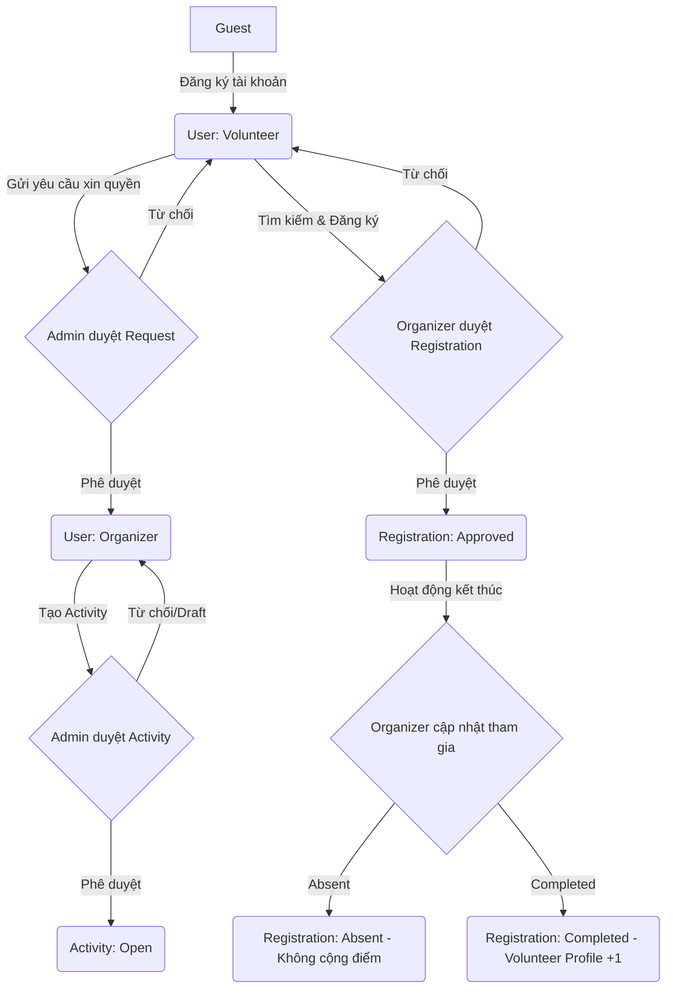

# BÁO CÁO PHÂN TÍCH THIẾT KẾ CƠ SỞ DỮ LIỆU (MONGODB)
## DỰ ÁN: VOLUNTEER CONNECT
**Vai trò:** Technical Lead / Senior Database Architect
**Tài liệu đầu vào:** BRD_VolunteerConnect-Project.docx (BRD-VLC-2026-002, Phiên bản 2.0)

---

## 1. Tổng quan dự án

### Mục tiêu dự án
Xây dựng một nền tảng Web Application (Volunteer Connect) nhằm kết nối trực tiếp tình nguyện viên (Volunteer) với các hoạt động cộng đồng (Activities). Giải quyết triệt để các vấn đề của phương pháp quản lý thủ công hiện tại (Google Form, Zalo, Excel, Facebook) như:
*   Khó khăn trong việc tìm kiếm hoạt động uy tín và phù hợp.
*   Quản lý danh sách, trạng thái đăng ký và tình hình tham gia thực tế kém hiệu quả.
*   Thiếu sự kiểm soát chất lượng từ Admin đối với các tổ chức.
*   Thiếu hệ thống ghi nhận, tích lũy lịch sử hoạt động để nâng cao uy tín cá nhân.
*   Không có công cụ thống kê trực quan cho ban quản trị và các tổ chức.

### Đối tượng sử dụng & Các vai trò (Role)
Hệ thống xác định 3 nhóm đối tượng người dùng chính (chưa bao gồm Khách vãng lai):
1.  **Volunteer (Tình nguyện viên):** Cá nhân đăng ký tham gia các hoạt động cộng đồng.
2.  **Organizer (Nhà tổ chức):** Đại diện các nhóm/tổ chức cộng đồng, chịu trách nhiệm tạo và vận hành hoạt động. Được chuyển đổi từ tài khoản Volunteer sau khi được Admin phê duyệt.
3.  **Admin (Quản trị viên):** Người kiểm duyệt yêu cầu xin quyền Organizer, phê duyệt hoạt động cộng đồng, quản lý người dùng và theo dõi hoạt động toàn hệ thống qua Dashboard.

### Giá trị hệ thống mang lại
*   **Tính tập trung:** Số hóa toàn bộ quy trình từ đề xuất, phê duyệt hoạt động, đăng ký tham gia đến đánh giá kết quả trên một nền tảng duy nhất.
*   **Tính minh bạch:** Mọi hoạt động cộng đồng đều được Admin phê duyệt trước khi công khai. Kết quả tham gia được xác nhận bởi Organizer để tính điểm tích lũy vào hồ sơ cá nhân của Volunteer.
*   **Tối ưu hóa nguồn lực:** Giảm tải công sức quản trị cho các nhóm thiện nguyện thông qua các công cụ tự động hóa xét duyệt và điểm danh trực tuyến.
*   **Thống kê thời gian thực:** Cung cấp cho Admin cái nhìn toàn diện về hoạt động thiện nguyện trong cộng đồng để có các định hướng phát triển phù hợp.

### Kiến trúc nghiệp vụ tổng thể
Hệ thống vận hành xoay quanh trục chính: **User (Volunteer) -> Xin quyền Organizer -> Tạo hoạt động (Activity) -> Đăng ký tham gia (Registration) -> Cập nhật kết quả (Completed/Absent) -> Tích lũy hồ sơ cá nhân**.


---

## 2. Phân tích Business Flow

Hệ thống bao gồm 6 luồng nghiệp vụ chính được phân tách chi tiết dưới đây:

### Flow 2.1: Authentication & Role Registration (Đăng ký, Đăng nhập & Đăng xuất)
*   **Mô tả:** Người dùng mới đăng ký tài khoản, mặc định nhận vai trò Volunteer và thực hiện các chức năng cơ bản.
*   **Các bước:**
    1.  Guest truy cập trang chủ -> Chọn Đăng ký tài khoản.
    2.  Nhập thông tin đăng ký (Họ tên, email, sđt, mật khẩu...).
    3.  Hệ thống kiểm tra tính hợp lệ và duy nhất của email.
    4.  Tạo tài khoản thành công với Role mặc định là `Volunteer`.
    5.  Người dùng thực hiện đăng nhập -> Nhận JWT Token/Session để truy cập hệ thống.
    6.  Người dùng đăng xuất -> Hủy Token/Session.

### Flow 2.2: Organizer Role Request (Yêu cầu xin quyền Organizer)
*   **Mô tả:** Quy trình nâng cấp tài khoản từ Volunteer lên Organizer để có quyền tạo hoạt động cộng đồng.
*   **Các bước:**
    1.  Volunteer đăng nhập -> Truy cập trang Profile cá nhân.
    2.  Bấm nút **Request Organizer Role**.
    3.  Nhập thông tin yêu cầu: Lý do, Kinh nghiệm hoặc Tên nhóm/tổ chức, Số điện thoại liên hệ.
    4.  Hệ thống lưu yêu cầu với trạng thái ban đầu là `Pending`.
    5.  Admin đăng nhập -> Truy cập trang quản lý phê duyệt vai trò.
    6.  Admin xem danh sách các yêu cầu `Pending` -> Chọn duyệt hoặc từ chối.
        *   **Nếu Approve:** Hệ thống chuyển trạng thái yêu cầu sang `Approved`, đồng thời cập nhật trường `role` của User từ `Volunteer` sang `Organizer`.
        *   **Nếu Reject:** Hệ thống chuyển trạng thái yêu cầu sang `Rejected`, vai trò của User giữ nguyên là `Volunteer`.

### Flow 2.3: Activity Create & Approval (Tạo và duyệt hoạt động)
*   **Mô tả:** Organizer tạo mới hoạt động cộng đồng và gửi Admin phê duyệt trước khi công khai.
*   **Các bước:**
    1.  Organizer đăng nhập -> Chọn **Create Activity**.
    2.  Nhập thông tin hoạt động: Tên hoạt động, Mô tả, Loại hoạt động, Địa điểm, Thời gian bắt đầu/kết thúc, Số lượng tình nguyện viên cần tuyển, Yêu cầu/Ghi chú, Ảnh minh họa (nếu có).
    3.  Organizer có thể chọn **Lưu nháp (Draft)** hoặc **Gửi duyệt (Submit for Review)**.
        *   Nếu Lưu nháp: Trạng thái là `Draft`, chỉ Organizer đó nhìn thấy và sửa đổi.
        *   Nếu Gửi duyệt: Trạng thái là `Pending Review`.
    4.  Admin đăng nhập -> Truy cập trang quản lý phê duyệt hoạt động.
    5.  Admin xem danh sách hoạt động `Pending Review` -> Xem chi tiết và chọn duyệt/từ chối.
        *   **Nếu Approve:** Trạng thái hoạt động chuyển sang `Open`. Hoạt động hiển thị công khai trên danh sách để Volunteer tìm kiếm và đăng ký.
        *   **Nếu Reject:** Trạng thái hoạt động chuyển sang `Rejected` và không hiển thị công khai.

### Flow 2.4: Activity Registration (Đăng ký tham gia)
*   **Mô tả:** Tình nguyện viên đăng ký tham gia các hoạt động cộng đồng đang mở tuyển.
*   **Các bước:**
    1.  Volunteer đăng nhập -> Xem danh sách hoạt động có trạng thái `Open`.
    2.  Chọn một hoạt động cụ thể để xem chi tiết.
    3.  Bấm **Register to Join**.
    4.  Hệ thống kiểm tra điều kiện đăng ký:
        *   Volunteer đã đăng ký hoạt động này trước đó chưa? (Tránh trùng lặp).
        *   Hoạt động còn chỗ trống không? (Nếu số lượng đăng ký đã duyệt đạt giới hạn cần tuyển, chặn đăng ký hoặc tự động chuyển trạng thái hoạt động sang `Full`).
    5.  Nếu hợp lệ, hệ thống tạo bản ghi đăng ký với trạng thái ban đầu là `Pending`.
    6.  Volunteer xem thông tin đăng ký trong màn hình **My Registered Activities**.

### Flow 2.5: Organizer Registration Approval (Organizer duyệt đăng ký)
*   **Mô tả:** Nhà tổ chức duyệt hoặc từ chối các lượt đăng ký tham gia hoạt động của mình.
*   **Các bước:**
    1.  Organizer vào phần quản lý hoạt động -> Chọn hoạt động cụ thể -> Xem danh sách các đăng ký đang ở trạng thái `Pending`.
    2.  Xem thông tin chi tiết của Volunteer đăng ký (Hồ sơ, kỹ năng, giới thiệu...).
    3.  Bấm **Approve** hoặc **Reject**.
        *   **Nếu Approve:** Trạng thái đăng ký chuyển từ `Pending` sang `Approved`.
        *   **Nếu Reject:** Trạng thái đăng ký chuyển từ `Pending` sang `Rejected`.
    *   Volunteer có thể vào trang cá nhân để theo dõi trạng thái cập nhật này.

### Flow 2.6: Participation Update & Profile Counter Update (Cập nhật kết quả tham gia & Tích lũy hồ sơ)
*   **Mô tả:** Sau khi hoạt động kết thúc, Organizer đánh giá quá trình tham gia thực tế của Volunteer và hệ thống tự động tích lũy số hoạt động đã hoàn thành cho Volunteer.
*   **Các bước:**
    1.  Hoạt động kết thúc (Dựa theo thời gian kết thúc hoặc Organizer chủ động đóng).
    2.  Organizer vào màn hình quản lý hoạt động -> Chọn hoạt động cần cập nhật tham gia.
    3.  Hệ thống hiển thị danh sách các Volunteer đã được duyệt tham gia trước đó (trạng thái đăng ký là `Approved`).
    4.  Organizer thực hiện đánh giá cho từng người:
        *   **Completed:** Volunteer tham gia đầy đủ và hoàn thành nhiệm vụ.
        *   **Absent:** Volunteer vắng mặt không lý do.
    5.  Hệ thống lưu trạng thái mới của bản ghi đăng ký tương ứng là `Completed` hoặc `Absent`.
    6.  **Xử lý Logic Profile Counter:**
        *   Nếu cập nhật thành `Completed`: Hệ thống kiểm tra xem bản ghi đăng ký này trước đó đã được tính điểm chưa (tránh cộng trùng lặp). Nếu chưa, hệ thống tăng trường `joined_activity_count` trong profile của Volunteer lên **+1**.
        *   Nếu cập nhật thành `Absent` hoặc các trạng thái khác: Không cộng điểm.

---

## 3. Liệt kê toàn bộ Module (MVP Scope)

Dưới đây là bảng phân tách chi tiết các Module bắt buộc trong phạm vi 2 tuần:

| Tên Module | Chức năng chính | Input chính | Output chính | Phụ thuộc |
| :--- | :--- | :--- | :--- | :--- |
| **Authentication & Role** | Đăng ký, đăng nhập, đăng xuất, phân quyền (Volunteer, Organizer, Admin) | Email, mật khẩu, họ tên, sđt, thông tin xác thực | JWT token, Session, User Role | Không |
| **Volunteer Profile** | Cập nhật hồ sơ cá nhân, hiển thị số hoạt động đã hoàn thành, hiển thị trạng thái yêu cầu xin quyền | Họ tên, khu vực hoạt động, kỹ năng, giới thiệu cá nhân | Profile thông tin cập nhật, Joined Activity Count | Authentication |
| **Organizer Role Request** | Volunteer gửi yêu cầu lên Organizer; Admin duyệt/từ chối yêu cầu chuyển role | Lý do, kinh nghiệm/tổ chức, số điện thoại liên hệ | Bản ghi Request (Pending/Approved/Rejected), Cập nhật Role của User | Authentication, Volunteer Profile |
| **Activity Management** | Organizer tạo, lưu nháp (Draft), gửi duyệt (Pending Review), quản lý hoạt động của mình | Tên, mô tả, thể loại, địa điểm, thời gian, số lượng cần tuyển, ảnh | Bản ghi Activity (Draft/Pending Review/Open) | Authentication |
| **Admin Activity Approval** | Admin duyệt hoặc từ chối các hoạt động đang chờ duyệt | ActivityId, quyết định duyệt (Approve/Reject) | Thay đổi trạng thái hoạt động (Open/Rejected) | Activity Management, Authentication |
| **Activity List & Detail** | Hiển thị danh sách hoạt động đang Open và thông tin chi tiết cho Volunteer | Tham số tìm kiếm, bộ lọc (thể loại, khu vực - optional) | Danh sách hoạt động `Open`, Trang chi tiết hoạt động | Activity Management, Admin Activity Approval |
| **Activity Registration** | Volunteer đăng ký tham gia hoạt động Open; Kiểm tra trùng lặp và giới hạn số lượng | UserId, ActivityId | Bản ghi Registration (Pending), Cập nhật trạng thái hoạt động (`Full` nếu đủ) | Authentication, Activity List & Detail |
| **Registration Approval** | Organizer duyệt hoặc từ chối các đơn đăng ký tham gia | RegistrationId, quyết định duyệt (Approve/Reject) | Thay đổi trạng thái đăng ký (Approved/Rejected) | Activity Registration, Activity Management |
| **Participation Update** | Đánh giá tình hình tham gia thực tế sau khi hoạt động kết thúc | RegistrationId, quyết định đánh giá (Completed/Absent) | Thay đổi trạng thái đăng ký (Completed/Absent), Profile Volunteer (`joined_activity_count` +1 nếu Completed) | Registration Approval, Volunteer Profile |
| **Admin Dashboard** | Thống kê số liệu toàn hệ thống; Hiển thị danh sách chờ duyệt | Yêu cầu truy cập | Statistic Cards, danh sách Request/Activity đang Pending | Tất cả các Module trên |
| **User Management** | Admin xem danh sách user, vai trò và thông tin cơ bản | Yêu cầu xem, UserId | Danh sách user, cập nhật thông tin user cơ bản | Authentication |

---

## 4. Phân tích Actor

Hệ thống gồm 4 Actor chính tham gia vận hành (không tự suy diễn thêm các vai trò như Moderator vì BRD không đề cập):

### Actor 4.1: Guest (Khách vãng lai)
*   **Quyền hạn:** Không cần tài khoản.
*   **Chức năng:** Xem thông tin giới thiệu chung về hệ thống, đăng ký tài khoản mới.
*   **Dữ liệu quản lý:** Không có dữ liệu cá nhân trên hệ thống.
*   **Quan hệ:** Đăng ký tài khoản để trở thành `Volunteer`.

### Actor 4.2: Volunteer (Tình nguyện viên)
*   **Quyền hạn:** Quyền đọc dữ liệu công khai, quyền tạo dữ liệu đăng ký tham gia và yêu cầu nâng cấp vai trò. Không được tạo hoạt động thiện nguyện.
*   **Chức năng:**
    *   Đăng nhập, đăng xuất, cập nhật thông tin hồ sơ cá nhân.
    *   Xem danh sách và chi tiết các hoạt động ở trạng thái `Open`.
    *   Đăng ký tham gia hoạt động.
    *   Xem danh sách hoạt động đã đăng ký và trạng thái của chúng.
    *   Gửi yêu cầu xin quyền Organizer từ trang profile cá nhân.
*   **Dữ liệu quản lý:** Dữ liệu profile cá nhân, danh sách đăng ký (`registrations` của bản thân), yêu cầu xin quyền Organizer (`organizer_requests` của bản thân).
*   **Quan hệ:** 
    *   Nhận thông tin phê duyệt từ `Admin` (đối với yêu cầu xin quyền).
    *   Đăng ký tham gia hoạt động do `Organizer` tạo và chờ `Organizer` phê duyệt.

### Actor 4.3: Organizer (Nhà tổ chức)
*   **Quyền hạn:** Quản lý các hoạt động do mình tạo, duyệt đơn đăng ký của Volunteer và đánh giá kết quả tham gia của Volunteer cho hoạt động của mình. Không có quyền quản trị hệ thống của người khác.
*   **Chức năng:**
    *   Tạo hoạt động mới (Draft / Gửi duyệt).
    *   Quản lý danh sách hoạt động do mình tạo.
    *   Duyệt hoặc từ chối Volunteer đăng ký tham gia hoạt động của mình.
    *   Sau khi hoạt động kết thúc, cập nhật kết quả tham gia cho Volunteer thành `Completed` hoặc `Absent`.
    *   Xem thống kê cơ bản của các hoạt động do mình tổ chức.
*   **Dữ liệu quản lý:** Thông tin hoạt động do mình tạo (`activities`), thông tin đăng ký của các Volunteer tham gia hoạt động của mình.
*   **Quan hệ:**
    *   Gửi hoạt động cho `Admin` duyệt.
    *   Duyệt và đánh giá quá trình tham gia của `Volunteer`.

### Actor 4.4: Admin (Quản trị viên)
*   **Quyền hạn:** Quyền quản lý tối cao trên toàn hệ thống.
*   **Chức năng:**
    *   Duyệt hoặc từ chối yêu cầu xin quyền Organizer của Volunteer.
    *   Duyệt hoặc từ chối hoạt động do Organizer tạo.
    *   Quản lý toàn bộ danh sách người dùng và hoạt động trong hệ thống.
    *   Xem Dashboard thống kê toàn diện (Tổng số user, tổng hoạt động theo từng trạng thái...).
*   **Dữ liệu quản lý:** Toàn bộ dữ liệu hệ thống (Users, Activities, Registrations, Requests).
*   **Quan hệ:** 
    *   Phê duyệt quyền hạn cho `Volunteer` lên `Organizer`.
    *   Phê duyệt hoạt động của `Organizer`.
    *   Giám sát hành vi của tất cả các Actor khác.

---

## 5. Liệt kê toàn bộ dữ liệu xuất hiện trong BRD

Dựa trên việc rà soát kỹ lưỡng tài liệu BRD, dưới đây là danh sách toàn bộ các thực thể dữ liệu (Entities) xuất hiện trong hệ thống:

1.  **User (Người dùng):** Thực thể cốt lõi lưu thông tin tài khoản và đăng nhập.
2.  **Profile (Hồ sơ cá nhân):** Thông tin chi tiết của Volunteer phục vụ cho việc đăng ký hoạt động.
3.  **Organizer Role Request (Yêu cầu xin quyền):** Bản ghi lưu thông tin yêu cầu nâng cấp vai trò của Volunteer lên Organizer.
4.  **Activity (Hoạt động):** Bản ghi chi tiết về một hoạt động cộng đồng/tình nguyện.
5.  **Activity Category (Loại hoạt động):** Danh mục phân loại hoạt động (Từ thiện, Môi trường, Giáo dục, Y tế, Gây quỹ, Hỗ trợ cộng đồng).
6.  **Activity Registration (Đăng ký tham gia):** Bản ghi liên kết thể hiện việc Volunteer đăng ký tham gia một Activity cụ thể.
7.  **Dashboard Statistics (Thống kê):** Dữ liệu tổng hợp phục vụ cho Admin Dashboard.

---

## 6. Phân tích Relationship giữa các Entity

Phần này phân tích cấu trúc quan hệ nghiệp vụ để làm cơ sở cho việc ánh xạ sang MongoDB Model (Embedded vs. Referenced):

```
+------------------+          1:N (Ref)          +--------------------------+
|      Users       | --------------------------> |  Organizer_Requests      |
|  (Volunteers/    | <-------------------------- |  (Lịch sử xin quyền)     |
|   Organizers)    |             1               +--------------------------+
+------------------+
  |              \
  | 1             \ 1
  |                \
  | N (Ref)         \ N (Ref)
  v                  v
+------------------+  1:N (Ref)  +--------------------------+
|    Activities    | ----------> |      Registrations       |
| (Các hoạt động)  |             | (Đăng ký & Điểm danh)    |
+------------------+             +--------------------------+
```

### 6.1. User (Volunteer) vs. Profile
*   **Mối quan hệ:** **One-to-One (1:1)**.
*   **Giải thích:** Mỗi người dùng chỉ có duy nhất một thông tin hồ sơ (Họ tên, Sđt, Kỹ năng, Số hoạt động đã hoàn thành...).
*   **Tính chất:** **Composition / Ownership**. Profile hoàn toàn thuộc sở hữu của User và không thể tồn tại độc lập nếu User bị xóa. Hồ sơ cá nhân có kích thước nhỏ và cố định, luôn được truy vấn cùng với thông tin tài khoản khi xem hồ sơ.

### 6.2. User (Volunteer) vs. Organizer Role Request
*   **Mối quan hệ:** **One-to-Many (1:N)**.
*   **Giải thích:** Một Volunteer có thể gửi yêu cầu xin quyền Organizer. Nếu yêu cầu đầu tiên bị Reject, Volunteer có thể gửi yêu cầu tiếp theo trong tương lai. Tuy nhiên tại một thời điểm, chỉ có tối đa một yêu cầu ở trạng thái `Pending`.
*   **Tính chất:** **Reference / Association**. Bản ghi Request tham chiếu tới ID của User gửi (`volunteer_id`). Yêu cầu xin quyền có vòng đời độc lập tương đối, cần được Admin truy vấn tập trung trên toàn hệ thống từ nhiều User khác nhau để duyệt.

### 6.3. User (Organizer) vs. Activity
*   **Mối quan hệ:** **One-to-Many (1:N)**.
*   **Giải thích:** Một Organizer có thể tạo và quản lý nhiều hoạt động cộng đồng khác nhau. Một hoạt động chỉ do duy nhất một Organizer tạo ra và làm chủ.
*   **Tính chất:** **Reference / Aggregate**. Mỗi document Activity sẽ lưu một tham chiếu ngoại (`organizer_id`) trỏ tới User tạo ra nó. Hoạt động có vòng đời độc lập; ngay cả khi Organizer bị khóa tài khoản, hoạt động và dữ liệu lịch sử tham gia của Volunteer vẫn cần được lưu trữ để đảm bảo tính toàn vẹn số liệu của hệ thống.

### 6.4. User (Volunteer) vs. Activity Registration
*   **Mối quan hệ:** **One-to-Many (1:N)**.
*   **Giải thích:** Một Volunteer có thể đăng ký tham gia nhiều hoạt động khác nhau theo thời gian.
*   **Tính chất:** **Reference / Association**. Bản ghi Registration lưu tham chiếu `volunteer_id` để biết ai đăng ký. Đây là bảng liên kết trung gian giải quyết quan hệ Many-to-Many giữa User và Activity.

### 6.5. Activity vs. Activity Registration
*   **Mối quan hệ:** **One-to-Many (1:N)**.
*   **Giải thích:** Một hoạt động cộng đồng sẽ nhận được nhiều đơn đăng ký tham gia từ các Volunteer khác nhau.
*   **Tính chất:** **Reference / Composition**. Bản ghi Registration lưu tham chiếu `activity_id`. Vòng đời của Registration phụ thuộc trực tiếp vào Activity. Nếu Activity bị hủy bỏ hoặc xóa bỏ vật lý, các đơn đăng ký liên quan cũng sẽ không còn ý nghĩa thực tế.

---

## 7. Phân tích kiến trúc MongoDB (Embed vs. Reference)

MongoDB lưu trữ dữ liệu dưới dạng Document. Để tối ưu hóa hiệu năng đọc/ghi và tránh các giới hạn vật lý (như giới hạn 16MB/document), chúng ta phân tích cách tổ chức lưu trữ cho từng thực thể:

### 7.1. Collection `users`
*   **Cấu trúc đề xuất:** **Tách Collection riêng** và **Embed Profile**.
*   **Chi tiết Embed:** Cấu trúc Profile (họ tên, email, sđt, khu vực hoạt động, kỹ năng, giới thiệu ngắn, joined activity count) sẽ được nhúng trực tiếp làm các trường (hoặc sub-document) bên trong document User.
*   **Lý do lựa chọn:**
    *   Quan hệ 1:1 chặt chẽ, dữ liệu profile luôn được truy vấn cùng với tài khoản.
    *   Tránh thao tác `$lookup` tốn kém khi hiển thị thông tin người dùng.
    *   Kích thước dữ liệu profile nhỏ, cố định, không có nguy cơ làm document vượt quá giới hạn 16MB.
    *   Kỹ năng (`skills`) là một danh sách nhỏ các chuỗi (Array of Strings), hoàn toàn tối ưu khi lưu dưới dạng Array trong document.

### 7.2. Collection `organizer_requests`
*   **Cấu trúc đề xuất:** **Tách Collection riêng**.
*   **Lý do lựa chọn:**
    *   *Tại sao không Embed vào `users`?* Mặc dù số lượng request trên một user là rất ít (thường chỉ 1 hoặc 2 lần), nhưng nghiệp vụ của Admin yêu cầu **truy vấn tập trung** tất cả các Request có trạng thái `Pending` từ mọi user trên hệ thống để hiển thị lên Dashboard duyệt. Nếu embed vào user, Admin sẽ phải quét qua toàn bộ collection `users` và sử dụng toán tử `$unwind` rất phức tạp và hiệu năng cực thấp khi lượng user lớn.
    *   *Tính chất tham chiếu:* Chỉ lưu tham chiếu `volunteer_id` (Reference) trỏ về `users`.
    *   *Denormalization (Phi chuẩn hóa):* Để Admin có thể xem nhanh danh sách phê duyệt mà không cần `$lookup` thông tin người dùng, chúng ta sẽ lưu kèm (denormalize) một số trường ít thay đổi như: `volunteer_name`, `volunteer_email`.

### 7.3. Collection `activities`
*   **Cấu trúc đề xuất:** **Tách Collection riêng**.
*   **Lý do lựa chọn:**
    *   Hoạt động là thực thể độc lập lớn, có tần suất truy vấn đọc rất cao từ Volunteer (tìm kiếm, xem danh sách) và Admin (quản lý).
    *   Thông tin hoạt động bao gồm mô tả chi tiết, địa điểm, thời gian, yêu cầu, ảnh minh họa nên dung lượng tương đối lớn.
    *   *Tham chiếu:* Lưu tham chiếu `organizer_id` trỏ về `users`.
    *   *Denormalization:* Nhúng thông tin tối giản của Organizer (ví dụ: `organizer_name`) vào document Activity để hiển thị nhanh trên UI danh sách hoạt động mà không cần `$lookup`.
    *   *Địa điểm (Location):* Lưu dưới dạng Embedded Sub-document gồm `{ province, district, address_detail }` trực tiếp trong Activity.
    *   *Loại hoạt động (Category):* Vì chỉ có các loại cố định (Từ thiện, Môi trường...), ta lưu trực tiếp dưới dạng String hoặc Embedded Sub-document nhỏ, không cần tạo collection danh mục riêng để tránh join phức tạp.

### 7.4. Collection `registrations`
*   **Cấu trúc đề xuất:** **Tách Collection riêng**.
*   **Lý do lựa chọn:**
    *   *Tại sao không embed danh sách Volunteer đăng ký trực tiếp vào `activities` dưới dạng một mảng?* Mặc dù số lượng Volunteer cho một hoạt động có giới hạn (ví dụ: 50 - 100 người) và không vượt quá giới hạn dung lượng document, nhưng nghiệp vụ hệ thống đòi hỏi Volunteer có thể truy vấn nhanh danh sách các hoạt động mình đã đăng ký (My Registered Activities). Nếu embed đăng ký vào Activity, việc tìm kiếm đăng ký của 1 Volunteer cụ thể sẽ đòi hỏi quét toàn bộ collection `activities` và lọc mảng, gây nghẽn hệ thống khi số lượng hoạt động tăng lên.
    *   *Tại sao không embed danh sách đăng ký vào `users`?* Một Volunteer có thể tham gia hàng trăm hoạt động theo thời gian, việc nhúng danh sách đăng ký vào User sẽ làm document User phình to liên tục và gây khó khăn cho Organizer khi cần duyệt danh sách đăng ký của một Activity cụ thể.
    *   *Giải pháp tối ưu:* Tách thành collection trung gian `registrations` lưu tham chiếu `volunteer_id` và `activity_id`.
    *   *Denormalization trong `registrations`:*
        *   Lưu thêm: `volunteer_name`, `volunteer_email`, `volunteer_phone` để Organizer duyệt nhanh trên giao diện quản lý mà không cần `$lookup` vào `users`.
        *   Lưu thêm: `activity_title`, `activity_start_date`, `activity_status` để Volunteer xem nhanh lịch sử đăng ký của mình mà không cần `$lookup` vào `activities`.
        *   *Rủi ro duplicate dữ liệu:* Khi người dùng đổi tên hoặc hoạt động sửa tiêu đề, dữ liệu denormalize sẽ bị lệch. Tuy nhiên, tên người dùng và tiêu đề hoạt động sau khi duyệt rất hiếm khi thay đổi. Với phạm vi MVP 2 tuần, việc chấp nhận duplicate này mang lại hiệu năng đọc vượt trội cho các màn hình danh sách.

---

## 8. Phân tích dữ liệu thay đổi nhiều (High-Frequency Data)

Trong hệ thống Volunteer Connect, một số thực thể sẽ có tần suất ghi và cập nhật trạng thái rất cao, cần có phương án thiết kế tối ưu:

### 8.1. Thực thể `registrations` (Đăng ký tham gia)
*   **Tần suất biến động:** **Rất cao (Đọc & Ghi liên tục)**.
    *   Volunteer liên tục tạo mới bản ghi khi đăng ký.
    *   Organizer liên tục cập nhật trạng thái: `Pending` -> `Approved` / `Rejected`.
    *   Sau hoạt động, Organizer cập nhật hàng loạt trạng thái: `Approved` -> `Completed` / `Absent`.
*   **Phương án xử lý:**
    *   **Tách collection riêng biệt** (đã đề xuất ở mục 7) để cô lập dữ liệu ghi cao, không ảnh hưởng đến hiệu năng đọc của collection chính là `activities` và `users`.
    *   **Batch Update:** Khi Organizer cập nhật tham gia (Completed/Absent) cho nhiều Volunteer sau hoạt động, API nên hỗ trợ cập nhật hàng loạt (Bulk Write) thay vì gửi từng request đơn lẻ để giảm tải kết nối tới Database.

### 8.2. Trường dữ liệu `joined_activity_count` trong `users`
*   **Tần suất biến động:** **Trung bình - Cao** (Cập nhật đồng loạt ngay khi hoạt động kết thúc).
*   **Rủi ro:** Khi Organizer điểm danh hoàn thành cho hàng loạt tình nguyện viên, hệ thống sẽ thực hiện cập nhật đồng thời trường này trên nhiều document User. Rủi ro xung đột dữ liệu hoặc lệch bộ đếm có thể xảy ra nếu xử lý không đồng bộ.
*   **Phương án xử lý:** Sử dụng toán tử atomic `$inc` của MongoDB (`{ $inc: { "profile.joined_activity_count": 1 } }`) kết hợp với kiểm tra trạng thái đăng ký trước đó để đảm bảo chỉ cộng điểm duy nhất một lần cho một Registration của Activity đó (Tránh race condition).

### 8.3. Thực thể `organizer_requests` (Yêu cầu vai trò)
*   **Tần suất biến động:** **Thấp - Trung bình** (Chỉ ghi khi Volunteer xin quyền và Admin duyệt).
*   **Phương án xử lý:** Tách collection để phục vụ truy vấn của Admin. Không cần cơ chế tối ưu ghi đặc biệt, nhưng cần đảm bảo tính nhất quán khi chuyển role người dùng.

### 8.4. Chiến lược Archive dữ liệu lịch sử
*   Khi hệ thống vận hành lâu dài (sau MVP), collection `registrations` sẽ phình to rất nhanh do tích lũy lịch sử đăng ký qua nhiều năm.
*   **Đề xuất:** Xây dựng cơ chế Archive định kỳ (ví dụ: mỗi 6 tháng). Di chuyển các bản ghi đăng ký đã hoàn thành (`Completed`, `Absent`, `Rejected`) của các hoạt động đã kết thúc từ lâu sang một collection lịch sử `registrations_archive` để giữ cho collection chạy runtime `registrations` luôn có kích thước nhỏ, tối ưu bộ nhớ RAM và tốc độ quét index.

---

## 9. Phân tích Thiết kế Index (MongoDB Indexes)

Để tối ưu hóa tốc độ truy vấn cho các màn hình chính của MVP, các index sau đây cần được thiết lập:

### 9.1. Collection `users`
*   **`email` (Unique Index):**
    *   *Cú pháp:* `{ email: 1 }` với thuộc tính `{ unique: true }`.
    *   *Lý do:* Đảm bảo không có hai người dùng đăng ký trùng email, tối ưu tốc độ truy vấn khi người dùng đăng nhập bằng email.
*   **`role` (Single Field Index):**
    *   *Cú pháp:* `{ role: 1 }`.
    *   *Lý do:* Tối ưu cho Admin khi truy vấn lọc danh sách người dùng theo vai trò (đặc biệt là lọc danh sách Volunteer để xem thông tin hoặc Organizer để quản lý).

### 9.2. Collection `organizer_requests`
*   **`status` (Single Field Index):**
    *   *Cú pháp:* `{ status: 1 }`.
    *   *Lý do:* Admin liên tục truy cập Dashboard để xem danh sách các yêu cầu đang `Pending`. Index này giúp loại bỏ việc quét toàn bộ bảng.
*   **`volunteer_id` (Single Field Index):**
    *   *Cú pháp:* `{ volunteer_id: 1 }`.
    *   *Lý do:* Tối ưu cho màn hình Profile của Volunteer khi kiểm tra xem bản thân đã gửi yêu cầu nào chưa và trạng thái yêu cầu đó thế nào.

### 9.3. Collection `activities`
*   **`status` (Single Field Index):**
    *   *Cú pháp:* `{ status: 1 }`.
    *   *Lý do:* Volunteer chỉ được xem các hoạt động `Open`. Admin cần phê duyệt hoạt động `Pending Review`. Index này cực kỳ quan trọng cho các câu lệnh đọc danh sách của cả 2 đối tượng.
*   **`organizer_id` (Single Field Index):**
    *   *Cú pháp:* `{ organizer_id: 1 }`.
    *   *Lý do:* Tối ưu cho màn hình "My Activities" của Organizer khi truy vấn các hoạt động do mình quản lý.
*   **Compound Index `{ status: 1, start_date: -1 }`:**
    *   *Lý do:* Volunteer xem danh sách hoạt động đang mở tuyển (`status: "Open"`) và sắp xếp theo thời gian bắt đầu mới nhất đến cũ nhất.
*   **Text Index `{ title: "text", description: "text" }`:**
    *   *Lý do:* Cho phép Volunteer tìm kiếm hoạt động bằng từ khóa (ví dụ: tìm kiếm "dọn rác", "từ thiện").

### 9.4. Collection `registrations`
*   **Compound Unique Index `{ volunteer_id: 1, activity_id: 1 }`:**
    *   *Cú pháp:* `{ volunteer_id: 1, activity_id: 1 }` với `{ unique: true }`.
    *   *Lý do:* Thực thi trực tiếp **BRule-09** ở tầng cơ sở dữ liệu. Ngăn chặn triệt để lỗi logic khiến một Volunteer đăng ký tham gia một hoạt động hai lần (ngay cả khi gửi song song hai request cùng lúc).
*   **`activity_id` (Single Field Index):**
    *   *Cú pháp:* `{ activity_id: 1 }`.
    *   *Lý do:* Tối ưu cho Organizer khi truy vấn danh sách tất cả Volunteer đã đăng ký vào hoạt động của mình để phê duyệt hoặc điểm danh.
*   **`volunteer_id` (Single Field Index):**
    *   *Cú pháp:* `{ volunteer_id: 1 }`.
    *   *Lý do:* Tối ưu cho màn hình "My Registered Activities" của Volunteer để theo dõi các hoạt động mình đã đăng ký.

---

## 10. Phân tích Khả năng mở rộng (Scalability)

Dù hệ thống bắt đầu với quy mô MVP 2 tuần, thiết kế cơ sở dữ liệu cần sẵn sàng cho lộ trình phát triển khi lượng người dùng tăng trưởng:

### 10.1. Chiến lược Replication (Replica Set)
*   **Thiết lập:** Cấu hình Replica Set tối thiểu 3 nodes (1 Primary, 2 Secondaries).
*   **Mục tiêu:**
    *   **High Availability (Tính sẵn sàng cao):** Tự động bầu chọn Primary mới nếu node chính gặp sự cố.
    *   **Read/Write Splitting:** Chuyển toàn bộ thao tác đọc (Volunteer xem danh sách hoạt động Open - chiếm 80% tải hệ thống) sang các node Secondaries. Giữ node Primary tập trung xử lý các thao tác ghi (đăng ký, duyệt đơn, tạo hoạt động).

### 10.2. Chiến lược Sharding (Horizontal Scaling) khi đạt quy mô lớn
Khi số lượng người dùng và dữ liệu đăng ký tăng vượt quá giới hạn lưu trữ và năng lực xử lý của một server đơn lẻ:

*   **Mốc 100k Users:** Hệ thống hoạt động tốt trên một Replica Set cấu hình trung bình kết hợp với Redis Cache. Chưa cần Sharding.
*   **Mốc 1M Users:** Bắt đầu áp dụng Sharding cho collection chịu tải lớn nhất là `registrations`.
*   **Mốc 10M Users:** Sharding toàn diện các collection chính.

#### Chọn Shard Key tối ưu:
1.  **Collection `users`:**
    *   *Shard Key đề xuất:* `{ _id: "hashed" }` hoặc Hashed Shard Key trên `email`.
    *   *Lý do:* Giúp phân tán đều tài khoản người dùng trên các shard, tránh tình trạng "hot shard" vì hành vi đăng nhập/truy cập thông tin cá nhân là phân tán ngẫu nhiên.
2.  **Collection `registrations` (Tần suất ghi lớn nhất):**
    *   *Shard Key đề xuất:* `{ volunteer_id: 1 }` hoặc `{ volunteer_id: "hashed" }`.
    *   *Lý do:* Giúp gom các đơn đăng ký của cùng một tình nguyện viên về cùng một shard. Tối ưu hóa truy vấn khi Volunteer xem lịch sử đăng ký của họ.
3.  **Collection `activities`:**
    *   *Shard Key đề xuất:* `{ organizer_id: "hashed" }` hoặc `{ province_code: 1 }` (nếu phân vùng địa lý sau này). Do số lượng hoạt động thấp hơn nhiều so với User và Registration, việc sharding `activities` chủ yếu để phục vụ tính sẵn sàng cao và phân tán theo vùng miền.

### 10.3. Caching & Search Engine
*   **Cache (Redis):**
    *   Cache danh sách hoạt động đang `Open` có lượt truy cập cao.
    *   Cache các Statistic Cards trên Admin Dashboard. Các bộ đếm như `Total Volunteers`, `Total Activities` sẽ được tính toán định kỳ (ví dụ: mỗi 5-10 phút) rồi lưu vào Redis thay vì chạy lệnh `$count` thời gian thực trên hàng triệu bản ghi MongoDB mỗi khi Admin tải trang.
*   **Search Engine (Elasticsearch / Atlas Search):**
    *   Khi dữ liệu hoạt động tăng cao, việc tìm kiếm văn bản phức tạp và tìm kiếm theo khoảng cách địa lý (Geo-location) nên được đồng bộ sang Elasticsearch để giảm tải truy vấn tìm kiếm cho MongoDB.

---

## 11. Các quyết định nghiệp vụ đã thống nhất & Ảnh hưởng thiết kế DB

Dưới đây là các câu trả lời nghiệp vụ từ PO/BA và các giải pháp thiết kế cơ sở dữ liệu tương ứng để hiện thực hóa các quy tắc này:

### 11.1. Về Trạng thái và Vòng đời hoạt động (Activity Lifecycle)
1.  **Quy tắc:** Khi hoạt động ở trạng thái `Full`, nếu có Volunteer hủy đăng ký hoặc bị Organizer từ chối (`Rejected`), hoạt động phải tự động quay về trạng thái `Open` để tuyển thêm người.
    *   *Ảnh hưởng thiết kế DB:* Nghiệp vụ này đòi hỏi tính nguyên tử cao. Khi cập nhật trạng thái một `registration` từ `Approved` sang `Cancelled` hoặc `Rejected`, hệ thống phải thực hiện kiểm tra chéo số lượng đăng ký đã duyệt hiện tại của `activity_id` đó. Nếu số lượng này nhỏ hơn giới hạn tuyển sinh và trạng thái hoạt động hiện tại là `Full`, hệ thống phải đồng thời cập nhật `status` của `activities` từ `Full` sang `Open`. Thao tác này **bắt buộc** bọc trong một **MongoDB Transaction**.
2.  **Quy tắc:** Chuyển trạng thái hoạt động sang `Ongoing` và `Completed` tự động bằng Cron Job của hệ thống dựa trên `start_date` và `end_date`.
    *   *Ảnh hưởng thiết kế DB:* Hệ thống cần chạy một tiến trình nền quét định kỳ (ví dụ: mỗi 5-10 phút). Để tối ưu hóa truy vấn quét này, chúng ta cần thiết lập một **Compound Index** gồm `{ status: 1, start_date: 1, end_date: 1 }` trên collection `activities`. Câu lệnh quét sẽ tìm các hoạt động có `status: "Open"` hoặc `status: "Full"` mà `start_date <= current_time` để chuyển sang `Ongoing`, và các hoạt động có `status: "Ongoing"` mà `end_date <= current_time` để chuyển sang `Completed`.
3.  **Quy tắc:** Organizer bị giới hạn thời gian (ví dụ: tối đa 7 ngày) sau khi hoạt động kết thúc để cập nhật trạng thái `Completed`/`Absent` cho Volunteer.
    *   *Ảnh hưởng thiết kế DB:* Ở tầng Database, chúng ta phải đảm bảo trường `end_date` của `activities` được lưu trữ dưới dạng kiểu dữ liệu `Date` (ISODate). Tầng Application logic sẽ thực hiện kiểm tra điều kiện validation: `current_time - activity.end_date <= 7 days` trước khi cho phép ghi nhận các cập nhật trạng thái trong `registrations`.

### 11.2. Về Quy tắc Đăng ký và Hủy đăng ký (Registration Rules)
4.  **Quy tắc:** Volunteer được chủ động hủy đăng ký ở trạng thái `Pending` hoặc `Approved` nhưng phải trước giờ bắt đầu của hoạt động tối thiểu 2 ngày.
    *   *Ảnh hưởng thiết kế DB:* Tương tự như trên, ứng dụng cần so sánh `activity.start_date` với thời điểm hiện tại. Trạng thái đăng ký sẽ được cập nhật thành `Cancelled`. Nếu đăng ký bị hủy trước đó đang ở trạng thái `Approved` và hoạt động đang ở trạng thái `Full`, ta áp dụng Transaction để tự động chuyển hoạt động về `Open` (như đã phân tích ở mục 11.1.1).
5.  **Quy tắc:** Hệ thống phải ngăn chặn việc Volunteer đăng ký tham gia các hoạt động trùng lặp về thời gian diễn ra (Overlap).
    *   *Ảnh hưởng thiết kế DB:* Đây là một bài toán tối ưu đọc rất quan trọng. Thay vì phải join hoặc `$lookup` để lấy thời gian của các hoạt động khác, chúng ta sẽ **denormalize cả hai trường `activity_start_date` và `activity_end_date` vào collection `registrations`**.
    *   Khi Volunteer đăng ký một hoạt động mới có khoảng thời gian `[new_start, new_end]`, hệ thống chỉ cần truy vấn trên collection `registrations` với điều kiện:
        *   `volunteer_id` = ID của Volunteer.
        *   `status` nằm trong danh sách `["Pending", "Approved"]`.
        *   Thời gian chồng chéo: `activity_start_date < new_end` VÀ `activity_end_date > new_start`.
    *   Nếu truy vấn này trả về bất kỳ kết quả nào, hệ thống sẽ chặn đăng ký. Thao tác này cực kỳ nhanh vì không cần dùng `$lookup` và chỉ chạy trên single collection `registrations` đã được index `{ volunteer_id: 1, status: 1 }`.

### 11.3. Về Quyền hạn & Chuyển đổi vai trò (Role & Permission)
6.  **Quy tắc:** Khi Volunteer được duyệt lên thành Organizer, họ vẫn được giữ vai trò Volunteer để tiếp tục tham gia các hoạt động khác dưới vai trò người tham gia.
    *   *Ảnh hưởng thiết kế DB:* Cấu trúc tài khoản trong collection `users` là đồng nhất. Vai trò `Organizer` sẽ là vai trò cha chứa tập hợp quyền lực cao hơn (Superset) bao gồm toàn bộ quyền của `Volunteer` (đăng ký tham gia, lịch sử profile). Do đó, schema không cần phân tách thành 2 loại tài khoản khác nhau mà chỉ cần lưu `role: "Organizer"` trong document `users`. Cả hai đối tượng đều dùng chung cơ chế đếm `joined_activity_count` và ghi nhận lịch sử qua collection `registrations`.
7.  **Quy tắc:** Organizer có quyền hủy (`Cancel`) hoạt động của mình sau khi đã được duyệt `Open`. Khi đó hệ thống tự động chuyển các đăng ký liên quan sang trạng thái `Cancelled`.
    *   *Ảnh hưởng thiết kế DB:* Khi hành động này xảy ra, hệ thống cần thực hiện:
        1. Cập nhật `status` của hoạt động tương ứng trong `activities` thành `Cancelled`.
        2. Cập nhật toàn bộ các bản ghi trong `registrations` có `activity_id` tương ứng và đang ở trạng thái `Pending` hoặc `Approved` sang trạng thái `Cancelled`.
        *   *Yêu cầu giao dịch:* Hai thao tác này phải được thực thi trong một **MongoDB Transaction** để tránh tình trạng hoạt động đã bị hủy nhưng Volunteer vẫn hiển thị là đang tham gia hoạt động đó.
8.  **Quy tắc:** Nếu Admin từ chối yêu cầu xin quyền Organizer của Volunteer, họ vẫn được gửi lại yêu cầu mới và có quy định khoảng thời gian chờ (Cooldown).
    *   *Ảnh hưởng thiết kế DB:* Collection `organizer_requests` cần ghi nhận trường `updated_at` (thời điểm Admin duyệt). Khi Volunteer muốn gửi request mới, hệ thống sẽ tìm kiếm bản ghi request gần nhất của Volunteer đó. Nếu trạng thái là `Rejected`, hệ thống sẽ kiểm tra xem thời gian hiện tại trừ đi `updated_at` đã vượt qua thời gian Cooldown quy định (ví dụ: 30 ngày) chưa. Để hỗ trợ tìm kiếm nhanh request gần nhất, ta cần index `{ volunteer_id: 1, created_at: -1 }`.

---

## 12. Tài liệu chuẩn bị thiết kế ERD (MongoDB Database Blueprint)

Đây là tài liệu đúc kết toàn bộ phân tích trên để làm đầu vào trực tiếp cho bước vẽ ERD và thiết kế Schema chi tiết:

### 12.1. Danh sách các Collection dự kiến
1.  **Collection `users`** (Lưu tài khoản, Profile nhúng, và vai trò: Admin, Organizer, Volunteer).
2.  **Collection `organizer_requests`** (Lưu lịch sử yêu cầu nâng cấp vai trò của Volunteer).
3.  **Collection `activities`** (Lưu thông tin chi tiết về các hoạt động cộng đồng).
4.  **Collection `registrations`** (Collection trung gian lưu các đơn đăng ký tham gia, trạng thái duyệt và kết quả điểm danh).
5.  **Collection `posts`** (Lưu bài đăng chia sẻ trên Feed cộng đồng).

### 12.2. Phân vùng cấu trúc Dữ liệu (Embed vs. Reference & Array)

#### A. Cấu trúc nhúng (Embedded Documents / Sub-documents)
*   **Thông tin Profile:** Nhúng toàn bộ vào document tương ứng trong collection `users`.
    *   *Các trường nhúng:* `full_name`, `phone`, `bio`, `area_of_interest`, `skills` (Array), `joined_activity_count` (Counter).
*   **Thông tin Địa điểm (Location):** Nhúng vào collection `activities`.
    *   *Các trường nhúng:* `province`, `district`, `address_detail`.
*   **Mảng dữ liệu (Arrays):**
    *   `skills` trong Profile: Lưu danh sách kỹ năng dưới dạng `[String]`.
    *   `categories` trong Activity: Lưu danh sách thể loại dưới dạng `[String]` (ví dụ: `["Từ thiện", "Môi trường"]`).

#### B. Cấu trúc tham chiếu (Referenced Documents)
*   `organizer_requests` tham chiếu tới `users` qua trường `volunteer_id` (ObjectId).
*   `activities` tham chiếu tới `users` qua trường `organizer_id` (ObjectId).
*   `registrations` tham chiếu tới cả `users` và `activities` qua:
    *   `volunteer_id` (ObjectId)
    *   `activity_id` (ObjectId)
*   `posts` tham chiếu tới `users` qua trường `author_id` (ObjectId).

#### C. Dữ liệu phi chuẩn hóa (Denormalized Fields - Phục vụ tối ưu Đọc)
*   Trong `organizer_requests`: Lưu thêm `volunteer_name`, `volunteer_email`.
*   Trong `activities`: Lưu thêm `organizer_name`.
*   Trong `registrations` (Tối quan trọng để loại bỏ `$lookup` khi hiển thị danh sách và check trùng lịch):
    *   Thông tin Volunteer: `volunteer_name`, `volunteer_phone`, `volunteer_email`.
    *   Thông tin Activity: `activity_title`, `activity_status`, `activity_start_date`, `activity_end_date` (Phục vụ truy vấn kiểm tra trùng lịch hoạt động).
*   Trong `posts`: Lưu thêm `denormalized_author.name`, `denormalized_author.role`, `denormalized_author.organization_name`.

### 12.3. Quy định xử lý Giao dịch (MongoDB Transactions)

#### Các nghiệp vụ BẮT BUỘC dùng Transaction (Multi-Document Transactions):
1.  **Nghiệp vụ "Cập nhật tham gia thành Completed":**
    *   Cập nhật trạng thái đăng ký của Volunteer thành `Completed` trong `registrations` và đồng thời tăng `joined_activity_count` trong `users` lên 1.
2.  **Nghiệp vụ "Đăng ký tham gia hoạt động (Race Condition)":**
    *   Đọc số lượng `registrations` hiện tại đã duyệt -> Kiểm tra giới hạn của `activities` -> Tạo mới bản ghi đăng ký -> Cập nhật trạng thái `Full` của hoạt động nếu đủ điều kiện.
3.  **Nghiệp vụ "Volunteer hủy đăng ký hoặc bị Organizer từ chối":**
    *   Chuyển trạng thái đăng ký trong `registrations` thành `Cancelled`/`Rejected`. Đồng thời nếu hoạt động đang `Full`, giảm số lượng người tham gia thực tế và cập nhật trạng thái hoạt động trong `activities` từ `Full` về `Open`.
4.  **Nghiệp vụ "Organizer hủy hoạt động":**
    *   Cập nhật trạng thái hoạt động trong `activities` thành `Cancelled`, đồng thời chuyển toàn bộ đăng ký liên quan đang `Pending` hoặc `Approved` trong `registrations` thành `Cancelled`.

#### Các nghiệp vụ KHÔNG CẦN dùng Transaction (Single-Document Operations):
1.  **Tạo mới Activity (Draft / Gửi duyệt):** Chỉ ghi một bản ghi vào collection `activities`.
2.  **Volunteer gửi yêu cầu xin quyền Organizer:** Chỉ ghi một bản ghi vào collection `organizer_requests`.
3.  **Organizer lưu nháp thay đổi thông tin hoạt động:** Chỉ cập nhật một bản ghi trong collection `activities`.
4.  **Admin phê duyệt hoạt động:** Cập nhật trạng thái `status` trong document `activities` tương ứng.
5.  **Admin duyệt/từ chối yêu cầu vai trò:** Cập nhật trạng thái request trong `organizer_requests` và chuyển đổi `role` của user trong `users` (dù tác động 2 collection nhưng tần suất thấp và không có nguy cơ race condition cao nên không bắt buộc dùng Transaction, tuy nhiên có thể bọc nếu muốn nhất quán 100%).
