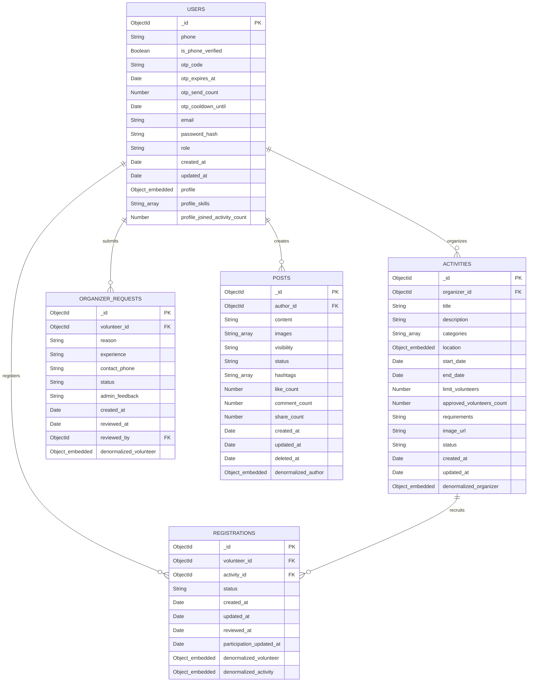

# THIẾT KẾ ERD & LOGICAL DATA MODEL (MONGODB)
## DỰ ÁN: VOLUNTEER CONNECT
**Vai trò:** Principal MongoDB Solution Architect, Data Architect
**Tài liệu tham khảo:** db_design_analysis.md

---

## 1. Xác định Aggregate Root

Trong MongoDB, một **Aggregate Root** là thực thể gốc (bản ghi chủ) của một cụm dữ liệu có thể truy cập trực tiếp bằng ID duy nhất và có vòng đời độc lập. Dưới đây là xác định Aggregate Root cho hệ thống:

1.  **User (`users`) - Aggregate Root**
    *   *Giải thích:* Người dùng là một thực thể cốt lõi. Mọi thông tin xác thực, phân quyền và hồ sơ cá nhân (`profile`) gắn liền với một người dùng cụ thể. Nó có vòng đời độc lập hoàn toàn và được truy vấn trực tiếp bằng `_id` từ các module Authentication, Profile, và User Management.
2.  **Activity (`activities`) - Aggregate Root**
    *   *Giải thích:* Mỗi hoạt động cộng đồng là một thực thể nghiệp vụ lớn và độc lập. Nó có vòng đời phức tạp (`Draft` $\rightarrow$ `Pending Review` $\rightarrow$ `Open` $\rightarrow$ `Full` $\rightarrow$ `Ongoing` $\rightarrow$ `Completed` hoặc `Rejected` / `Cancelled`). Hoạt động được truy vấn trực tiếp bởi Volunteer (tìm kiếm) và Admin (phê duyệt). Mọi thông tin như địa điểm (`location`), yêu cầu, thể loại đều là sub-document thuộc hoạt động này.
3.  **Registration (`registrations`) - Aggregate Root**
    *   *Giải thích:* Mặc dù là thực thể liên kết (bridge) giữa User và Activity, nhưng trong MongoDB, `Registration` bắt buộc phải là một Aggregate Root độc lập. Lý do: Nó có vòng đời nghiệp vụ riêng biệt (`Pending` $\rightarrow$ `Approved`/`Rejected` $\rightarrow$ `Completed`/`Absent`), tần suất ghi nhận và thay đổi trạng thái rất cao, và cần được truy vấn độc lập từ cả hai phía (Volunteer muốn xem lịch sử tham gia của mình, Organizer muốn quản lý danh sách đăng ký của hoạt động). Nếu nhúng vào User hoặc Activity, nó sẽ tạo ra mảng phát triển vô hạn (unbounded array) và gây nghẽn hiệu năng đọc/ghi nghiêm trọng.
4.  **OrganizerRequest (`organizer_requests`) - Aggregate Root**
    *   *Giải thích:* Yêu cầu xin quyền Organizer của Volunteer có vòng đời độc lập và cần được Admin truy vấn tập trung trên toàn hệ thống (lọc tất cả các yêu cầu đang `Pending`). Nó không được nhúng vào User để tránh việc Admin phải quét toàn bộ collection `users` bằng toán tử `$unwind` rất tốn kém tài nguyên.

---

## 2. Thiết kế Collection

Hệ thống bao gồm 4 Collection chính phục vụ cho MVP:

```
+---------------------------------------------------------------------------------+
|                                 DATABASE BLUEPRINT                              |
+----------------------+--------------------+--------------------+----------------+
|   Collection Name    |  Read/Write Ratio  |   Estimated Size   |  Growth Rate   |
+----------------------+--------------------+--------------------+----------------+
| users                |        90:10       |  ~1.5 KB / doc     |  Tuyến tính    |
| activities           |        80:20       |  ~3.0 KB / doc     |  Tuyến tính    |
| registrations        |        60:40       |  ~1.0 KB / doc     |  Rất nhanh     |
| organizer_requests   |        10:90 (W)   |  ~0.8 KB / doc     |  Chậm          |
+----------------------+--------------------+--------------------+----------------+
```

### 2.1. Collection `users`
*   **Mục đích:** Lưu trữ thông tin tài khoản đăng nhập, thông tin cấu hình xác thực, vai trò hệ thống và thông tin hồ sơ chi tiết (Profile) của người dùng.
*   **Owner (Chủ sở hữu):** Bản thân người dùng sở hữu tài khoản của mình.
*   **Lifecycle (Vòng đời):** Bắt đầu khi người dùng đăng ký tài khoản $\rightarrow$ cập nhật profile $\rightarrow$ đổi vai trò (nếu được Admin duyệt lên Organizer) $\rightarrow$ bị khóa (nếu vi phạm quy chế) $\rightarrow$ vô hiệu hóa tài khoản.
*   **Business Responsibility:** Quản lý danh tính (Identity), phân quyền (Authorization), lưu trữ hồ sơ cá nhân và tích lũy số lượng hoạt động đã hoàn thành (`joined_activity_count`).
*   **Estimated Size (Kích thước ước lượng):** ~1.5 KB / document (bao gồm mảng kỹ năng và thông tin profile).
*   **Growth Rate (Tốc độ tăng trưởng):** Tuyến tính (tương ứng với số lượng người dùng mới đăng ký).
*   **Read/Write Ratio (Tỉ lệ Đọc/Ghi):** **90:10** (Đọc thông tin profile và đăng nhập rất nhiều, ghi/cập nhật profile ít hơn).

### 2.2. Collection `activities`
*   **Mục đích:** Lưu trữ thông tin chi tiết về các chiến dịch/hoạt động cộng đồng.
*   **Owner:** Được sở hữu bởi Organizer tạo ra nó.
*   **Lifecycle:** `Draft` $\rightarrow$ `Pending Review` $\rightarrow$ `Open` (Admin duyệt) hoặc `Rejected` $\rightarrow$ `Full` (khi đủ người) $\rightarrow$ `Ongoing` (khi đến giờ bắt đầu) $\rightarrow$ `Completed` (khi kết thúc) hoặc có thể bị `Cancelled` bởi Organizer.
*   **Business Responsibility:** Hiển thị thông tin hoạt động thiện nguyện, kiểm soát số lượng tình nguyện viên tuyển dụng và theo dõi tiến độ hoạt động.
*   **Estimated Size:** ~3.0 KB / document (bao gồm thông tin chi tiết hoạt động, địa điểm nhúng, mảng thể loại, ảnh).
*   **Growth Rate:** Tuyến tính (tương ứng với số hoạt động mới được Organizer đề xuất).
*   **Read/Write Ratio:** **80:20** (Volunteer đọc, tìm kiếm hoạt động liên tục; chỉ ghi khi tạo mới, phê duyệt hoặc khi tự động cập nhật trạng thái qua Cron Job).

### 2.3. Collection `registrations`
*   **Mục đích:** Ghi nhận liên kết đăng ký tham gia của Volunteer vào một hoạt động cụ thể và lưu kết quả đánh giá điểm danh sau hoạt động.
*   **Owner:** Thuộc sở hữu chung của Volunteer (người tạo đơn) và Organizer (người quản lý/duyệt đơn).
*   **Lifecycle:** `Pending` (Đăng ký mới) $\rightarrow$ `Approved` hoặc `Rejected` (Organizer duyệt) $\rightarrow$ `Completed` hoặc `Absent` (Organizer điểm danh sau sự kiện) hoặc có thể chuyển sang `Cancelled` nếu Volunteer chủ động hủy đơn trước 2 ngày diễn ra sự kiện hoặc hoạt động bị hủy.
*   **Business Responsibility:** Quản lý quy trình đăng ký, điểm danh, chống trùng lịch đăng ký, kiểm soát số lượng người tham gia thực tế và kích hoạt tăng bộ đếm hồ sơ cho Volunteer.
*   **Estimated Size:** ~1.0 KB / document (chứa tham chiếu ID và các thông tin phi chuẩn hóa).
*   **Growth Rate:** **Rất nhanh** (mỗi Volunteer có thể đăng ký hàng chục hoạt động, số lượng bản ghi tăng theo cấp số nhân: $O(Users \times Activities)$).
*   **Read/Write Ratio:** **60:40** (Organizer đọc danh sách duyệt, Volunteer đọc lịch sử của mình; Ghi và cập nhật trạng thái diễn ra liên tục).

### 2.4. Collection `organizer_requests`
*   **Mục đích:** Lưu các đơn đề xuất nâng cấp vai trò của tình nguyện viên lên thành nhà tổ chức.
*   **Owner:** Được sở hữu bởi Volunteer gửi đơn; phê duyệt bởi Admin.
*   **Lifecycle:** `Pending` $\rightarrow$ `Approved` (Role User chuyển sang Organizer) hoặc `Rejected` (User giữ nguyên role Volunteer).
*   **Business Responsibility:** Kiểm soát quy trình cấp quyền tổ chức hoạt động cộng đồng một cách trực quan, ghi lại lịch sử duyệt để làm cơ sở tính thời gian cooldown (thời gian chờ gửi lại yêu cầu).
*   **Estimated Size:** ~0.8 KB / document.
*   **Growth Rate:** Chậm (chỉ phát sinh khi có Volunteer muốn nâng cấp quyền).
*   **Read/Write Ratio:** **10:90** (Hầu như chỉ ghi khi Volunteer gửi yêu cầu, Admin ghi khi phê duyệt; Đọc chỉ diễn ra trên Dashboard phê duyệt của Admin).

---

## 3. Thiết kế Document Chi tiết (Document Field Specification)

### 3.1. Collection `users`
Document đại diện cho một tài khoản và hồ sơ người dùng trong hệ thống.

| Tên Field | Kiểu Dữ Liệu | Required | Nullable | Default | Mô Tả & Quy Tắc Nghiệp Vụ | Validation Rule |
| :--- | :--- | :--- | :---: | :--- | :--- | :--- |
| `_id` | ObjectId | **Yes** | No | Auto | Khóa chính duy nhất của User | Hệ thống tự sinh |
| `phone` | String | **Yes** | No | None | Số điện thoại đăng ký và đăng nhập, là duy nhất | Định dạng số điện thoại hợp lệ (10 chữ số) |
| `is_phone_verified` | Boolean | **Yes** | No | `false` | Trạng thái xác minh số điện thoại qua OTP | Chỉ nhận `true` hoặc `false` |
| `otp_code` | String | No | **Yes** | null | Mã OTP hiện tại đang chờ xác minh (nên được mã hóa/băm) | Chuỗi OTP số, thường là 6 ký tự |
| `otp_expires_at` | Date | No | **Yes** | null | Thời điểm mã OTP hiện tại hết hạn | Kiểu dữ liệu Date |
| `otp_send_count` | Number | **Yes** | No | 0 | Số lần gửi OTP trong chu kỳ cửa sổ thời gian hiện tại | Số nguyên không âm |
| `otp_cooldown_until` | Date | No | **Yes** | null | Thời điểm được phép gửi mã OTP tiếp theo (để chống spam) | Kiểu dữ liệu Date |
| `email` | String | No | **Yes** | null | Email liên hệ, là duy nhất (Sparse Unique Index) | Đúng định dạng email, `lowercase: true` |
| `password_hash` | String | **Yes** | No | None | Mật mã đã băm (bcrypt/argon2) | Chiều dài chuỗi băm tiêu chuẩn |
| `role` | String | **Yes** | No | "Volunteer" | Vai trò truy cập: `"Volunteer"`, `"Organizer"`, `"Admin"` | Chỉ chấp nhận 1 trong 3 giá trị Enum |
| `created_at` | Date | **Yes** | No | NOW | Thời điểm tạo tài khoản | Kiểu dữ liệu Date |
| `updated_at` | Date | **Yes** | No | NOW | Thời điểm cập nhật tài khoản gần nhất | Kiểu dữ liệu Date |
| `profile` | Object | **Yes** | No | `{}` | **Embedded Document** lưu hồ sơ cá nhân | Xem cấu trúc chi tiết phía dưới |

#### Embedded Document: `users.profile`
| Tên Field | Kiểu Dữ Liệu | Required | Nullable | Default | Mô Tả & Quy Tắc Nghiệp Vụ | Validation Rule |
| :--- | :--- | :---: | :---: | :--- | :--- | :--- |
| `full_name` | String | **Yes** | No | None | Họ và tên đầy đủ của người dùng | Chuỗi từ 2 - 50 ký tự, không chứa ký tự đặc biệt |
| `bio` | String | No | **Yes** | null | Giới thiệu ngắn về bản thân | Tối đa 500 ký tự |
| `area_of_interest` | String | No | **Yes** | null | Khu vực hoạt động tình nguyện ưu thích | Tối đa 100 ký tự |
| `skills` | Array [String] | **Yes** | No | `[]` | Mảng chứa danh sách kỹ năng của Volunteer | Mảng chuỗi, mỗi kỹ năng tối đa 50 ký tự |
| `joined_activity_count` | Number | **Yes** | No | 0 | Tổng số hoạt động đã hoàn thành (`Completed`) | Số nguyên không âm ($\ge 0$). Chỉ được tăng bởi Transaction |

---

### 3.2. Collection `organizer_requests`
Document lưu thông tin yêu cầu xin quyền tổ chức hoạt động của Volunteer.

| Tên Field | Kiểu Dữ Liệu | Required | Nullable | Default | Mô Tả & Quy Tắc Nghiệp Vụ | Validation Rule |
| :--- | :--- | :---: | :---: | :--- | :--- | :--- |
| `_id` | ObjectId | **Yes** | No | Auto | Khóa chính duy nhất của yêu cầu | Hệ thống tự sinh |
| `volunteer_id` | ObjectId | **Yes** | No | None | **Reference Key** trỏ tới `users._id` | Phải tồn tại trong collection `users` |
| `reason` | String | **Yes** | No | None | Lý do muốn trở thành Organizer | Chuỗi từ 10 - 1000 ký tự |
| `experience` | String | No | **Yes** | null | Kinh nghiệm hoạt động xã hội hoặc tên tổ chức | Tối đa 1000 ký tự |
| `contact_phone` | String | **Yes** | No | None | Số điện thoại liên hệ phục vụ phê duyệt | Định dạng sđt hợp lệ |
| `status` | String | **Yes** | No | "Pending" | Trạng thái yêu cầu: `"Pending"`, `"Approved"`, `"Rejected"` | Enum của 3 giá trị trên |
| `admin_feedback` | String | No | **Yes** | null | Ý kiến phê duyệt hoặc lý do từ chối từ Admin | Tối đa 500 ký tự |
| `created_at` | Date | **Yes** | No | NOW | Thời điểm gửi yêu cầu | Kiểu dữ liệu Date |
| `reviewed_at` | Date | No | **Yes** | null | Thời điểm Admin xử lý yêu cầu (dùng tính Cooldown) | Kiểu dữ liệu Date |
| `reviewed_by` | ObjectId | No | **Yes** | null | **Reference Key** trỏ tới Admin xử lý | Phải tồn tại trong `users` và có `role = "Admin"` |
| `denormalized_volunteer` | Object | **Yes** | No | None | **Denormalized Sub-document** thông tin Volunteer | Xem cấu trúc chi tiết phía dưới |

#### Denormalized Document: `organizer_requests.denormalized_volunteer`
| Tên Field | Kiểu Dữ Liệu | Required | Nullable | Default | Mô Tả & Quy Tắc Nghiệp Vụ | Validation Rule |
| :--- | :--- | :---: | :---: | :--- | :--- | :--- |
| `name` | String | **Yes** | No | None | Bản sao họ tên (`users.profile.full_name`) | Đồng bộ khi gửi request |
| `email` | String | **Yes** | No | None | Bản sao email đăng nhập (`users.email`) | Đồng bộ khi gửi request |

---

### 3.3. Collection `activities`
Document đại diện cho một hoạt động cộng đồng được tạo bởi Organizer.

| Tên Field | Kiểu Dữ Liệu | Required | Nullable | Default | Mô Tả & Quy Tắc Nghiệp Vụ | Validation Rule |
| :--- | :--- | :---: | :---: | :--- | :--- | :--- |
| `_id` | ObjectId | **Yes** | No | Auto | Khóa chính duy nhất của hoạt động | Hệ thống tự sinh |
| `organizer_id` | ObjectId | **Yes** | No | None | **Reference Key** trỏ tới `users._id` (nhà tổ chức) | Phải là User có `role = "Organizer"` |
| `title` | String | **Yes** | No | None | Tiêu đề của hoạt động cộng đồng | Chuỗi từ 5 - 150 ký tự |
| `description` | String | **Yes** | No | None | Mô tả chi tiết mục đích, công việc hoạt động | Chuỗi tối thiểu 20 ký tự |
| `categories` | Array [String]| **Yes** | No | `[]` | Các thể loại hoạt động (Ví dụ: Từ thiện, Môi trường) | Mảng chứa các giá trị danh mục hợp lệ |
| `location` | Object | **Yes** | No | None | **Embedded Document** địa chỉ chi tiết hoạt động | Xem cấu trúc chi tiết phía dưới |
| `start_date` | Date | **Yes** | No | None | Thời điểm bắt đầu hoạt động. Phải tương lai | Phải lớn hơn thời gian hiện tại khi tạo |
| `end_date` | Date | **Yes** | No | None | Thời điểm kết thúc hoạt động | Phải lớn hơn `start_date` |
| `limit_volunteers` | Number | **Yes** | No | None | Số lượng tình nguyện viên tối đa cần tuyển | Số nguyên dương $> 0$ |
| `approved_volunteers_count` | Number | **Yes** | No | 0 | Số Volunteer đã được duyệt (`Approved`) tham gia | Số nguyên không âm, $\le$ `limit_volunteers` |
| `requirements` | String | No | **Yes** | null | Các yêu cầu đặc thù hoặc ghi chú đối với Volunteer | Tối đa 1000 ký tự |
| `image_url` | String | No | **Yes** | null | Link ảnh minh họa cho hoạt động | Định dạng URL hợp lệ |
| `status` | String | **Yes** | No | "Draft" | Trạng thái: `"Draft"`, `"Pending Review"`, `"Open"`, `"Full"`, `"Ongoing"`, `"Completed"`, `"Rejected"`, `"Cancelled"` | Enum của các giá trị trạng thái trên |
| `created_at` | Date | **Yes** | No | NOW | Ngày khởi tạo hoạt động | Kiểu dữ liệu Date |
| `updated_at` | Date | **Yes** | No | NOW | Ngày cập nhật thông tin hoạt động gần nhất | Kiểu dữ liệu Date |
| `denormalized_organizer` | Object | **Yes** | No | None | **Denormalized Sub-document** thông tin Organizer | Xem cấu trúc chi tiết phía dưới |

#### Embedded Document: `activities.location`
| Tên Field | Kiểu Dữ Liệu | Required | Nullable | Default | Mô Tả & Quy Tắc Nghiệp Vụ | Validation Rule |
| :--- | :--- | :---: | :---: | :--- | :--- | :--- |
| `province` | String | **Yes** | No | None | Tỉnh hoặc Thành phố trực thuộc trung ương | Chuỗi ký tự, tối đa 50 ký tự |
| `district` | String | **Yes** | No | None | Quận hoặc Huyện trực thuộc Tỉnh/TP | Chuỗi ký tự, tối đa 50 ký tự |
| `address_detail` | String | **Yes** | No | None | Số nhà, tên đường, thôn/xóm cụ thể | Chuỗi ký tự, tối đa 200 ký tự |

#### Denormalized Document: `activities.denormalized_organizer`
| Tên Field | Kiểu Dữ Liệu | Required | Nullable | Default | Mô Tả & Quy Tắc Nghiệp Vụ | Validation Rule |
| :--- | :--- | :---: | :---: | :--- | :--- | :--- |
| `name` | String | **Yes** | No | None | Bản sao họ tên Organizer (`users.profile.full_name`) | Đồng bộ khi duyệt/xuất bản hoạt động |

---

### 3.4. Collection `registrations`
Document trung gian lưu đăng ký của Volunteer vào Activity và kết quả điểm danh.

| Tên Field | Kiểu Dữ Liệu | Required | Nullable | Default | Mô Tả & Quy Tắc Nghiệp Vụ | Validation Rule |
| :--- | :--- | :---: | :---: | :--- | :--- | :--- |
| `_id` | ObjectId | **Yes** | No | Auto | Khóa chính duy nhất của lượt đăng ký | Hệ thống tự sinh |
| `volunteer_id` | ObjectId | **Yes** | No | None | **Reference Key** trỏ tới `users._id` (Volunteer) | Phải tồn tại trong collection `users` |
| `activity_id` | ObjectId | **Yes** | No | None | **Reference Key** trỏ tới `activities._id` (Hoạt động) | Phải tồn tại trong collection `activities` |
| `status` | String | **Yes** | No | "Pending" | Trạng thái: `"Pending"`, `"Approved"`, `"Rejected"`, `"Completed"`, `"Absent"`, `"Cancelled"` | Enum của các giá trị trạng thái trên |
| `created_at` | Date | **Yes** | No | NOW | Ngày đăng ký tham gia | Kiểu dữ liệu Date |
| `updated_at` | Date | **Yes** | No | NOW | Ngày cập nhật trạng thái đơn gần nhất | Kiểu dữ liệu Date |
| `reviewed_at` | Date | No | **Yes** | null | Thời điểm Organizer duyệt/từ chối đơn | Kiểu dữ liệu Date |
| `participation_updated_at`| Date| No | **Yes** | null | Thời điểm Organizer điểm danh sau sự kiện | Kiểu dữ liệu Date |
| `denormalized_volunteer` | Object | **Yes** | No | None | **Denormalized Sub-document** thông tin Volunteer | Xem cấu trúc chi tiết phía dưới |
| `denormalized_activity` | Object | **Yes** | No | None | **Denormalized Sub-document** thông tin Activity | Xem cấu trúc chi tiết phía dưới |

#### Denormalized Document: `registrations.denormalized_volunteer`
| Tên Field | Kiểu Dữ Liệu | Required | Nullable | Default | Mô Tả & Quy Tắc Nghiệp Vụ | Validation Rule |
| :--- | :--- | :---: | :---: | :--- | :--- | :--- |
| `name` | String | **Yes** | No | None | Bản sao họ tên Volunteer (`users.profile.full_name`) | Đồng bộ khi đăng ký |
| `phone` | String | **Yes** | No | None | Bản sao sđt của Volunteer (`users.phone`) | Đồng bộ khi đăng ký |
| `email` | String | **Yes** | No | None | Bản sao email của Volunteer (`users.email`) | Đồng bộ khi đăng ký |

#### Denormalized Document: `registrations.denormalized_activity`
| Tên Field | Kiểu Dữ Liệu | Required | Nullable | Default | Mô Tả & Quy Tắc Nghiệp Vụ | Validation Rule |
| :--- | :--- | :---: | :---: | :--- | :--- | :--- |
| `title` | String | **Yes** | No | None | Bản sao tiêu đề hoạt động (`activities.title`) | Đồng bộ khi đăng ký |
| `status` | String | **Yes** | No | None | Bản sao trạng thái hoạt động (`activities.status`) | Đồng bộ khi đăng ký |
| `start_date` | Date | **Yes** | No | None | Bản sao giờ bắt đầu (`activities.start_date`) - dùng check trùng lịch | Đồng bộ khi đăng ký |
| `end_date` | Date | **Yes** | No | None | Bản sao giờ kết thúc (`activities.end_date`) - dùng check trùng lịch | Đồng bộ khi đăng ký |

---

## 4. Danh sách Embedded Document (Tài liệu nhúng)

Quyết định nhúng tài liệu trong MongoDB dựa trên nguyên tắc: **Dữ liệu có vòng đời phụ thuộc, kích thước nhỏ và thường xuyên được truy vấn cùng Aggregate Root**.

1.  **`profile` nhúng trong `users`:**
    *   *Vì sao nhúng:* Thông tin hồ sơ cá nhân và tài khoản đăng nhập là một thể thống nhất (quan hệ 1:1). Việc nhúng giúp loại bỏ hoàn toàn các câu lệnh `$lookup` khi người dùng xem profile của mình, đăng nhập hoặc hiển thị thông tin tác giả.
2.  **`location` nhúng trong `activities`:**
    *   *Vì sao nhúng:* Địa điểm diễn ra hoạt động là thông tin bắt buộc gắn liền với chính hoạt động đó (quan hệ 1:1). Nó không có vòng đời độc lập (hoạt động biến mất thì địa điểm này trên hệ thống cũng không cần quản lý riêng lẻ).
3.  **`denormalized_volunteer` nhúng trong `organizer_requests` & `registrations`:**
    *   *Vì sao nhúng:* Bản sao thông tin cơ bản của Volunteer (tên, email, sđt) được nhúng để Admin và Organizer xem nhanh danh sách đơn chờ duyệt mà không cần join chéo sang collection `users`.
4.  **`denormalized_organizer` nhúng trong `activities`:**
    *   *Vì sao nhúng:* Bản sao tên nhà tổ chức giúp hiển thị tên Organizer trên các danh sách hoạt động mà không cần join chéo.
5.  **`denormalized_activity` nhúng trong `registrations`:**
    *   *Vì sao nhúng:* Nhúng thông tin hoạt động (`title`, `status`, `start_date`, `end_date`) giúp Volunteer xem nhanh lịch sử hoạt động đã đăng ký và hỗ trợ đắc lực cho thuật toán **kiểm tra trùng lịch hoạt động** (Overlap Check) ngay trên single collection `registrations`.

---

## 5. Danh sách Reference (Tham chiếu giữa các Collection)

Sử dụng tham chiếu dạng **Manual Reference** thông qua kiểu dữ liệu `ObjectId` khi các thực thể có vòng đời độc lập (Aggregate Roots) và có mối quan hệ liên kết có số lượng phần tử lớn:

1.  **`organizer_requests` $\rightarrow$ `users` (N : 1)**
    *   Mỗi yêu cầu nâng quyền chứa trường `volunteer_id` tham chiếu đến `users._id` để liên kết đến người dùng thực hiện yêu cầu.
2.  **`activities` $\rightarrow$ `users` (N : 1)**
    *   Mỗi hoạt động chứa trường `organizer_id` tham chiếu đến `users._id` nhằm xác định nhà tổ chức chịu trách nhiệm.
3.  **`registrations` $\rightarrow$ `users` (N : 1)**
    *   Mỗi đơn đăng ký chứa trường `volunteer_id` tham chiếu đến `users._id` để liên kết với tình nguyện viên đăng ký tham gia.
4.  **`registrations` $\rightarrow$ `activities` (N : 1)**
    *   Mỗi đơn đăng ký chứa trường `activity_id` tham chiếu đến `activities._id` để liên kết đến hoạt động thiện nguyện.

---

## 6. Mảng dữ liệu (Array Fields)

Sử dụng mảng dữ liệu trong MongoDB cho các thuộc tính đa trị có giới hạn kích thước phần tử rõ ràng và cố định (Bounded Array):

1.  **`users.profile.skills` (Mảng chuỗi):**
    *   Lưu danh sách kỹ năng của Volunteer (Ví dụ: `["Dạy học", "Trồng rừng", "Y tế sơ cứu"]`). Số lượng kỹ năng của một người dùng thực tế không vượt quá 30 phần tử, rất tối ưu khi nhúng trực tiếp làm mảng chuỗi.
2.  **`activities.categories` (Mảng chuỗi):**
    *   Lưu danh sách các danh mục phân loại hoạt động (Ví dụ: `["Từ thiện", "Y tế"]`). Số lượng danh mục cho một hoạt động rất ít (thường từ 1 - 3 danh mục), hoàn toàn phù hợp để lưu mảng chuỗi trực tiếp.

---

## 7. Dữ liệu phi chuẩn hóa (Denormalized Data)

Để ưu tiên tối đa hiệu năng đọc (Read Performance) của Web App trong 2 tuần demo, các trường dữ liệu sau đây được sao chép và đồng bộ:

```
+------------------------------------------------------------------------------------------------------+
|                                     DENORMALIZATION SYNC MATRIX                                      |
+---------------------+-------------------+---------------------+------------------+-------------------+
|  Denormalized Field |    Source Path    |  Destination Path   |  Sync Trigger    |   Updated By      |
+---------------------+-------------------+---------------------+------------------+-------------------+
| volunteer.name      | users.profile...  | registrations.de... | Lúc đăng ký      | Hệ thống          |
| volunteer.phone     | users.profile...  | registrations.de... | Lúc đăng ký      | Hệ thống          |
| volunteer.email     | users.email       | registrations.de... | Lúc đăng ký      | Hệ thống          |
| volunteer.name      | users.profile...  | organizer_requ...   | Lúc gửi request  | Hệ thống          |
| volunteer.email     | users.email       | organizer_requ...   | Lúc gửi request  | Hệ thống          |
| activity.title      | activities.title  | registrations.de... | Lúc đăng ký      | Hệ thống          |
| activity.status     | activities.status | registrations.de... | Khi đổi status   | Cron / Organizer  |
| activity.dates      | activities.dates  | registrations.de... | Lúc đăng ký      | Hệ thống          |
| organizer.name      | users.profile...  | activities.deno...  | Lúc tạo/duyệt    | Hệ thống          |
+---------------------+-------------------+---------------------+------------------+-------------------+
```

*   **Đồng bộ khi có cập nhật:** 
    *   Tên người dùng (`users.profile.full_name`) và tiêu đề hoạt động (`activities.title`) là các thông tin rất ít khi thay đổi. Nếu có thay đổi, hệ thống sẽ thực hiện cập nhật nền (Background Job/Update Many) sang các collection liên quan để đảm bảo tính nhất quán cuối cùng (Eventual Consistency).
    *   Trạng thái hoạt động (`activities.status`) thay đổi (do Cron Job chạy chuyển sang `Ongoing`/`Completed` hoặc Organizer `Cancelled`), hệ thống sẽ kích hoạt lệnh cập nhật đồng bộ trường `denormalized_activity.status` tương ứng trong collection `registrations`. Thao tác này được thực hiện chung trong Transaction đổi trạng thái hoạt động.

---

## 8. Biên giao dịch (Transaction Boundary)

Dưới đây là đặc tả chi tiết của 4 nghiệp vụ **bắt buộc** sử dụng MongoDB Multi-Document Transactions để đảm bảo tính nhất quán (ACID):

### Transaction 8.1: Đăng ký tham gia hoạt động (Race Condition Prevention)
*   **Các Collection tham gia:** `activities` $\rightarrow$ `registrations`
*   **Trigger (Điều kiện kích hoạt):** Volunteer bấm nút **Register to Join**.
*   **Tiến trình thực thi:**
    1.  Bắt đầu Session & Transaction.
    2.  Đọc document trong `activities` theo `activity_id` kèm theo cơ chế ghi nhận khóa (hoặc kiểm tra version/số lượng) để lấy thông tin `limit_volunteers` và `approved_volunteers_count`.
    3.  Kiểm tra điều kiện: Nếu `approved_volunteers_count >= limit_volunteers`, tiến hành hủy bỏ (Abort) Transaction và báo lỗi hoạt động đã đầy.
    4.  Kiểm tra trong `registrations` xem đã có bản ghi nào trùng khớp cặp `{ volunteer_id, activity_id }` chưa. Nếu có, hủy bỏ Transaction.
    5.  Tạo mới bản ghi đăng ký với trạng thái `Pending` trong collection `registrations`.
    6.  Commit Transaction.
*   **Rollback:** Nếu bất kỳ bước nào thất bại hoặc dữ liệu không nhất quán, hủy bỏ toàn bộ thay đổi. Đảm bảo không tạo đơn đăng ký dư thừa.
*   **Yêu cầu nhất quán:** Tránh Race Condition khi nhiều người cùng đăng ký ở giây cuối cùng khiến số lượng đăng ký vượt quá giới hạn thiết lập của hoạt động.

### Transaction 8.2: Hủy đăng ký / Từ chối đăng ký (Auto-open logic)
*   **Các Collection tham gia:** `registrations` $\rightarrow$ `activities`
*   **Trigger:** Volunteer chủ động bấm **Cancel** (trước 2 ngày) hoặc Organizer bấm **Reject** đơn đăng ký.
*   **Tiến trình thực thi:**
    1.  Bắt đầu Transaction.
    2.  Cập nhật trạng thái đăng ký trong `registrations` thành `Cancelled` hoặc `Rejected`.
    3.  Nếu trạng thái của đơn trước khi hủy là `Approved`, hệ thống giảm trường `approved_volunteers_count` trong document tương ứng của `activities` đi **-1**.
    4.  Kiểm tra trạng thái hoạt động hiện tại trong `activities`. Nếu trạng thái hiện tại là `Full`, hệ thống sẽ cập nhật trạng thái hoạt động thành `Open`.
    5.  Commit Transaction.
*   **Rollback:** Đảm bảo không xảy ra tình trạng đơn đăng ký đã hủy nhưng bộ đếm số người tham gia của hoạt động không được giảm, hoặc hoạt động bị giữ nguyên trạng thái `Full` dù đã có chỗ trống.

### Transaction 8.3: Điểm danh hoàn thành hoạt động (Counter Update)
*   **Các Collection tham gia:** `registrations` $\rightarrow$ `users`
*   **Trigger:** Sau sự kiện, Organizer vào giao diện cập nhật kết quả và chọn trạng thái **Completed** cho Volunteer.
*   **Tiến trình thực thi:**
    1.  Bắt đầu Transaction.
    2.  Đọc trạng thái đăng ký hiện tại trong `registrations`. Nếu trạng thái hiện tại đã là `Completed`, hủy bỏ Transaction (ngăn chặn cộng trùng lặp - BRule-18).
    3.  Cập nhật trạng thái đăng ký trong `registrations` từ `Approved` sang `Completed`.
    4.  Cập nhật tăng trường `profile.joined_activity_count` của Volunteer tương ứng trong collection `users` lên **+1** bằng toán tử atomic `$inc`.
    5.  Commit Transaction.
*   **Rollback:** Đảm bảo tính nhất quán tuyệt đối giữa trạng thái đơn hàng/đăng ký và hồ sơ năng lực của Volunteer. Tránh lỗi tăng số lượng ảo hoặc cập nhật Completed nhưng không được cộng điểm.

### Transaction 8.4: Organizer hủy hoạt động (Cancel Activity)
*   **Các Collection tham gia:** `activities` $\rightarrow$ `registrations`
*   **Trigger:** Organizer chọn hủy hoạt động đã được phê duyệt.
*   **Tiến trình thực thi:**
    1.  Bắt đầu Transaction.
    2.  Cập nhật trạng thái hoạt động trong `activities` thành `Cancelled`.
    3.  Cập nhật đồng loạt (Bulk Update) trạng thái của toàn bộ đơn đăng ký có `activity_id` tương ứng và đang ở trạng thái `Pending` hoặc `Approved` trong collection `registrations` thành `Cancelled`.
    4.  Commit Transaction.
*   **Rollback:** Đảm bảo hoạt động bị hủy thì tất cả các đơn đăng ký liên quan cũng phải chuyển sang hủy. Không để lại các đơn đăng ký mồ côi ở trạng thái `Approved`.

---

## 9. Phân tích Cardinality & Mối quan hệ giữa các Collection

Mối quan hệ giữa các Aggregate Root được đặc tả thông qua bản đồ Cardinality dưới đây:

### 9.1. User vs. OrganizerRequest (1 : N)
*   **Loại quan hệ:** Một người dùng có thể gửi nhiều yêu cầu xin quyền Organizer theo dòng thời gian (nếu các yêu cầu trước bị Admin từ chối). Tuy nhiên, chỉ có tối đa 1 request ở trạng thái `Pending` được phép tồn tại để tránh spam.
*   **Khóa liên kết:** `organizer_requests.volunteer_id` (ObjectId) $\rightarrow$ `users._id` (ObjectId).

### 9.2. User (Organizer) vs. Activity (1 : N)
*   **Loại quan hệ:** Một nhà tổ chức (User có Role Organizer) có thể tạo ra và quản lý nhiều hoạt động cộng đồng khác nhau. Một hoạt động chỉ thuộc quyền quản lý của một Organizer duy nhất.
*   **Khóa liên kết:** `activities.organizer_id` (ObjectId) $\rightarrow$ `users._id` (ObjectId).

### 9.3. User (Volunteer) vs. Registration (1 : N)
*   **Loại quan hệ:** Một tình nguyện viên có thể đăng ký tham gia nhiều hoạt động khác nhau để tích lũy kinh nghiệm, do đó sở hữu nhiều bản ghi đăng ký.
*   **Khóa liên kết:** `registrations.volunteer_id` (ObjectId) $\rightarrow$ `users._id` (ObjectId).

### 9.4. Activity vs. Registration (1 : N)
*   **Loại quan hệ:** Một hoạt động cộng đồng sẽ tiếp nhận danh sách đăng ký từ nhiều Volunteer khác nhau.
*   **Khóa liên kết:** `registrations.activity_id` (ObjectId) $\rightarrow$ `activities._id` (ObjectId).

---

## 10. Quyền sở hữu dữ liệu (Ownership Model)

Quy định cấu trúc phân cấp sở hữu các thực thể và sub-document để quản lý vòng đời dữ liệu một cách nhất quán:

*   **`users` owns:**
    *   `profile` (Embedded Document)
    *   `skills` (Embedded Array of Strings)
*   **`activities` owns:**
    *   `location` (Embedded Document)
    *   `categories` (Embedded Array of Strings)
    *   `denormalized_organizer` (Embedded Document)
*   **`registrations` owns:**
    *   `denormalized_volunteer` (Embedded Document)
    *   `denormalized_activity` (Embedded Document)
*   **`organizer_requests` owns:**
    *   `denormalized_volunteer` (Embedded Document)

---

## 11. Sơ đồ thực thể liên kết - MongoDB ERD (Mermaid)



---

## 12. Đặc tả Cấu trúc & Annotation cho từng Collection

### 12.1. Annotations for `users`
*   **Aggregate Root:** Yes.
*   **Embedded Documents:** `profile`.
*   **Arrays:** `profile.skills` (Array of Strings).
*   **Transactions:** Cập nhật trường `profile.joined_activity_count` thông qua transaction điểm danh của collection `registrations`.
*   **Indexes:**
    *   `{ phone: 1 }` (Unique Index, định danh chính dùng cho xác thực đăng ký/đăng nhập OTP).
    *   `{ email: 1 }` (Unique Index, phục vụ liên kết email, có thuộc tính `{ sparse: true }` để hỗ trợ giá trị null khi chưa điền).
    *   `{ role: 1 }` (Single Field Index, phục vụ User Management).
    *   `{ created_at: 1 }` (Partial TTL Index, `{ expireAfterSeconds: 3600, partialFilterExpression: { is_phone_verified: false } }` tự động dọn dẹp tài khoản rác sau 1 giờ nếu không xác minh OTP thành công).

### 12.2. Annotations for `organizer_requests`
*   **Aggregate Root:** Yes.
*   **Reference Keys:** `volunteer_id` trỏ đến `users._id`, `reviewed_by` trỏ đến `users._id`.
*   **Denormalized Documents:** `denormalized_volunteer` (chứa `name` và `email`).
*   **Indexes:**
    *   `{ status: 1 }` (Single Field Index, phục vụ Admin lọc yêu cầu Pending).
    *   `{ volunteer_id: 1, created_at: -1 }` (Compound Index, phục vụ Volunteer kiểm tra yêu cầu gần nhất và tính toán Cooldown).

### 12.3. Annotations for `activities`
*   **Aggregate Root:** Yes.
*   **Reference Keys:** `organizer_id` trỏ đến `users._id`.
*   **Embedded Documents:** `location`.
*   **Arrays:** `categories` (Array of Strings).
*   **Denormalized Documents:** `denormalized_organizer` (chứa `name`).
*   **Transactions:** Tham gia vào Transaction đăng ký (kiểm tra giới hạn và tăng bộ đếm), Transaction hủy đăng ký (giảm bộ đếm và đổi status về Open), và Transaction hủy hoạt động.
*   **Indexes:**
    *   `{ status: 1 }` (Single Field Index, phục vụ truy vấn danh sách Open hoặc duyệt).
    *   `{ organizer_id: 1 }` (Single Field Index, phục vụ Organizer lọc danh sách hoạt động của mình).
    *   `{ status: 1, start_date: 1, end_date: 1 }` (Compound Index, phục vụ Cron Job quét chuyển trạng thái tự động).
    *   `{ title: "text", description: "text" }` (Text Index, phục vụ tìm kiếm từ khóa).

### 12.4. Annotations for `registrations`
*   **Aggregate Root:** Yes.
*   **Reference Keys:** `volunteer_id` trỏ đến `users._id`, `activity_id` trỏ đến `activities._id`.
*   **Denormalized Documents:**
    *   `denormalized_volunteer` (chứa `name`, `phone`, `email`).
    *   `denormalized_activity` (chứa `title`, `status`, `start_date`, `end_date`).
*   **Transactions:** Là trọng tâm của các Transaction: Đăng ký tham gia (tạo mới đơn), Hủy/Từ chối đăng ký (cập nhật status và trả trạng thái hoạt động về Open), Điểm danh hoàn thành (tăng counter của User), Hủy hoạt động (cập nhật trạng thái hàng loạt).
*   **Indexes:**
    *   `{ volunteer_id: 1, activity_id: 1 }` (Compound Unique Index, thực thi quy tắc BRule-09 chặn đăng ký trùng lặp ở tầng DB).
    *   `{ activity_id: 1, status: 1 }` (Compound Index, phục vụ Organizer xem danh sách duyệt và điểm danh tình nguyện viên theo hoạt động).
    *   `{ volunteer_id: 1, status: 1 }` (Compound Index, phục vụ Volunteer lọc danh sách đơn của mình theo trạng thái).
    *   `{ volunteer_id: 1, status: 1, "denormalized_activity.start_date": 1, "denormalized_activity.end_date": 1 }` (Compound Index phức hợp, phục vụ tối ưu hóa thuật toán kiểm tra trùng lịch hoạt động).

### 12.5. Annotations for `posts` (Volunteer Feed)
*   **Aggregate Root:** Yes.
*   **Reference Keys:** `author_id` trỏ đến `users._id`.
*   **Embedded Documents:** `denormalized_author` (chứa `name`, `role`, `organization_name` - nếu có).
*   **Arrays:** `images` (Mảng link ảnh của bài viết), `hashtags` (Mảng từ khóa tìm kiếm).
*   **Indexes:**
    *   `{ status: 1, visibility: 1, created_at: -1 }` (Compound Index, phục vụ tải trang Feed theo thời gian thực).
    *   `{ author_id: 1, created_at: -1 }` (Compound Index, phục vụ hiển thị lịch sử bài đăng trên Profile của User).
    *   `{ hashtags: 1, status: 1 }` (Compound Index, phục vụ lọc bài viết theo hashtag).
    *   `{ content: "text" }` (Text Index, phục vụ tìm kiếm bài viết bằng từ khóa).

---

## 13. Tự kiểm tra và Đánh giá thiết kế (Architect Design Review)

Hệ thống thiết kế đã được kiểm duyệt nghiêm ngặt qua các tiêu chí chất lượng sau:

*   **✔ Kiểm tra Collection dư/thiếu:** Hệ thống gom chính xác thông tin tài khoản và profile vào collection `users`, thông tin hoạt động và địa điểm vào `activities`. Thêm duy nhất **01 Collection mới** là `posts` cho Volunteer Feed. Các comment hay like không bị tách bảng để tránh tình trạng join chéo làm chậm hiệu năng tải Feed.
*   **✔ Kiểm tra Embed sai:** Thông tin Profile nhúng vào User, và địa chỉ nhúng vào Activity là chính xác. Bản sao tác giả nhúng vào Post giúp tải nhanh Feed (Feed-oriented design).
*   **✔ Kiểm tra Circular Reference (Tham chiếu vòng):** Không có hiện tượng tham chiếu chéo. Các liên kết từ `posts` đi thẳng đến `users._id` (N:1).
*   **✔ Kiểm tra Document quá lớn & Mảng phát triển vô hạn (Unbounded Array):**
    *   *Rủi ro của Post Feed:* Nếu nhúng mảng bình luận (Comments) hay mảng người thích (Likes) vô hạn trong document `Post`, kích thước tài liệu sẽ vượt quá 16MB khi bài viết trở nên thịnh hành.
    *   *Giải pháp MVP:* Chỉ lưu trữ thống kê số lượng (`like_count`, `comment_count`, `share_count`) dưới dạng số nguyên (Counters) trong tài liệu `Post`. Các bình luận chi tiết sẽ không nhúng vô hạn, hoặc trong tương lai khi có nhu cầu lưu nội dung bình luận, ta mới tách collection `comments` riêng biệt. Với phạm vi MVP, giải pháp dùng counter là hoàn hảo và tuyệt đối an toàn cho kích thước document. Mảng `images` (tối đa 5-10 ảnh) và `hashtags` (tối đa 10 tag) đều giới hạn số lượng nên không có nguy cơ phình to.
*   **✔ Kiểm tra Transaction dư thừa:** `posts` hoạt động độc lập và không yêu cầu giao dịch nhiều collection phức tạp. Việc tăng/giảm like hay comment được thực hiện qua các toán tử atomic tăng trưởng `$inc` đơn lẻ, không cần Transaction.
*   **✔ Tối ưu hiệu năng Đọc (Read Optimized):** Nhờ nhúng `denormalized_author` gồm tên và vai trò trực tiếp vào `Post`, trang Feed cộng đồng có thể được kết xuất ngay lập tức chỉ với một câu truy vấn trên collection `posts`, giảm tải join dữ liệu xuống 0%.

---

## 14. Bổ sung: Thiết kế tính năng Volunteer Feed (Community Post)

Theo yêu cầu từ PO về việc thêm trang Feed cộng đồng để chia sẻ hình ảnh, trải nghiệm và thành tích mà chỉ sử dụng đúng **01 Collection mới** là `posts` và không phá vỡ cấu trúc cũ, giải pháp được thiết kế như sau:

### 14.1. Thiết kế Collection `posts`
*   **Mục đích:** Lưu trữ các bài đăng chia sẻ của tình nguyện viên hoặc nhà tổ chức.
*   **Giải thích lựa chọn thiết kế:**
    *   Feed cộng đồng yêu cầu tốc độ tải trang cực nhanh (hiển thị danh sách bài đăng kèm tên, vai trò người viết). Việc tách collection `posts` độc lập và sử dụng kỹ thuật phi chuẩn hóa (Denormalization) thông tin tác giả giúp hệ thống tải Feed với hiệu năng $O(1)$ lần đọc DB trên mỗi document bài viết.
    *   Để đáp ứng ràng buộc MVP không làm phình to database và không tạo thêm collection phụ, các tính năng tương tác (likes, comments, shares) được lưu trữ tối giản dưới dạng bộ đếm (Counters) trong chính document của Post.

### 14.2. Đặc tả Document `posts` chi tiết

| Tên Field | Kiểu Dữ Liệu | Required | Nullable | Default | Mô Tả & Quy Tắc Nghiệp Vụ | Validation Rule |
| :--- | :--- | :---: | :---: | :--- | :--- | :--- |
| `_id` | ObjectId | **Yes** | No | Auto | Khóa chính duy nhất của bài viết | Hệ thống tự sinh |
| `author_id` | ObjectId | **Yes** | No | None | **Reference Key** trỏ tới `users._id` | Phải tồn tại trong collection `users` |
| `content` | String | **Yes** | No | None | Nội dung văn bản của bài viết chia sẻ | Chuỗi từ 10 - 5000 ký tự |
| `images` | Array [String] | **Yes** | No | `[]` | Mảng chứa danh sách URL ảnh đính kèm bài viết | Mảng chuỗi định dạng URL, tối đa 10 ảnh |
| `visibility` | String | **Yes** | No | "Public" | Quyền riêng tư: `"Public"`, `"Organization"` (nội bộ), `"Private"` | Chỉ chấp nhận giá trị Enum |
| `status` | String | **Yes** | No | "Active" | Trạng thái bài đăng: `"Active"`, `"Deleted"`, `"Flagged"` (bị báo cáo) | Chỉ chấp nhận giá trị Enum |
| `hashtags` | Array [String] | **Yes** | No | `[]` | Mảng các hashtag phân loại (ví dụ: `["tuthien", "donrac"]`) | Mỗi tag viết liền không dấu, tối đa 15 tag |
| `like_count` | Number | **Yes** | No | 0 | Bộ đếm số lượt yêu thích | Số nguyên không âm $\ge 0$ |
| `comment_count` | Number | **Yes** | No | 0 | Bộ đếm số lượt bình luận | Số nguyên không âm $\ge 0$ |
| `share_count` | Number | **Yes** | No | 0 | Bộ đếm số lượt chia sẻ | Số nguyên không âm $\ge 0$ |
| `created_at` | Date | **Yes** | No | NOW | Ngày đăng bài | Kiểu dữ liệu Date |
| `updated_at` | Date | **Yes** | No | NOW | Ngày cập nhật nội dung bài đăng | Kiểu dữ liệu Date |
| `deleted_at` | Date | No | **Yes** | null | Ngày xóa bài (nếu thực hiện soft delete) | Kiểu dữ liệu Date |
| `denormalized_author` | Object | **Yes** | No | None | **Denormalized Sub-document** thông tin tác giả | Xem cấu trúc chi tiết phía dưới |

#### Denormalized Document: `posts.denormalized_author`
| Tên Field | Kiểu Dữ Liệu | Required | Nullable | Default | Mô Tả & Quy Tắc Nghiệp Vụ | Validation Rule |
| :--- | :--- | :---: | :---: | :--- | :--- | :--- |
| `name` | String | **Yes** | No | None | Bản sao họ tên (`users.profile.full_name`) | Đồng bộ khi tạo bài viết |
| `role` | String | **Yes** | No | None | Bản sao vai trò lúc đăng bài (`users.role`) | Đồng bộ khi tạo bài viết |
| `organization_name` | String | No | **Yes** | null | Bản sao tên nhóm/tổ chức nếu tác giả là Organizer | Lấy từ `organizer_requests.experience` nếu có |

### 14.3. Quan hệ giữa các thực thể (Relationship & Reference)
*   **posts $\rightarrow$ users (N : 1 Reference):**
    *   Trường `author_id` thiết lập mối quan hệ tham chiếu thủ công (Manual Reference) một chiều từ Post đến User.
    *   *Vì sao không dùng Embed:* Tác giả đăng bài có vòng đời hoàn toàn độc lập với bài viết. Nếu nhúng bài đăng vào tài liệu User, document User sẽ phình to không giới hạn khi họ viết nhiều bài đăng (Unbounded Array), đồng thời khiến cho việc tổng hợp trang Feed từ tất cả người dùng trở nên bất khả thi.

### 14.4. Dữ liệu phi chuẩn hóa và Cơ chế đồng bộ (Denormalization & Sync)
*   Thông tin tác giả (`name`, `role`, `organization_name`) được sao chép trực tiếp vào sub-document `denormalized_author` ngay khi bài viết được tạo.
*   **Cơ chế đồng bộ khi User cập nhật Profile:**
    *   *Kịch bản:* Người dùng đổi họ tên trong trang Profile cá nhân.
    *   *Giải pháp:* Để giữ cho DB nhất quán mà vẫn đạt hiệu năng cao, hệ thống sẽ thực hiện cập nhật không đồng bộ (Asynchronous/Background Update). Ứng dụng sẽ gửi một tác vụ nền cập nhật tất cả tài liệu trong collection `posts` có `author_id` tương ứng bằng câu lệnh `db.posts.updateMany({ "author_id": userId }, { "$set": { "denormalized_author.name": newName } })`. Do tên người dùng rất hiếm khi thay đổi, tải xử lý của tác vụ nền này trên thực tế là cực kỳ thấp.

### 14.5. Thiết kế Index tối ưu hóa cho Volunteer Feed
Để hỗ trợ tải trang Feed nhanh chóng với phân trang (Pagination) và các tính năng lọc bài viết, các index sau được triển khai:
1.  **Compound Index `{ status: 1, visibility: 1, created_at: -1 }`:**
    *   *Mục đích:* Tối ưu hóa truy vấn tải trang Feed chính của cộng đồng. Hệ thống chỉ lấy bài viết có `status: "Active"`, `visibility: "Public"` và sắp xếp theo thời gian tạo mới nhất lên đầu.
2.  **Compound Index `{ author_id: 1, created_at: -1 }`:**
    *   *Mục đích:* Lọc danh sách bài đăng của riêng một cá nhân để hiển thị trên trang Profile cá nhân của họ.
3.  **Compound Index `{ hashtags: 1, status: 1 }`:**
    *   *Mục đích:* Tối ưu hóa truy vấn khi người dùng bấm vào một hashtag (ví dụ: `#tuthien`) để lọc các bài đăng liên quan.
4.  **Text Index `{ content: "text" }`:**
    *   *Mục đích:* Hỗ trợ tính năng tìm kiếm bài viết theo từ khóa nội dung trên Feed.
